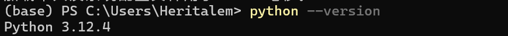
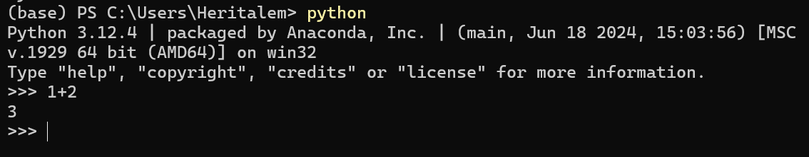
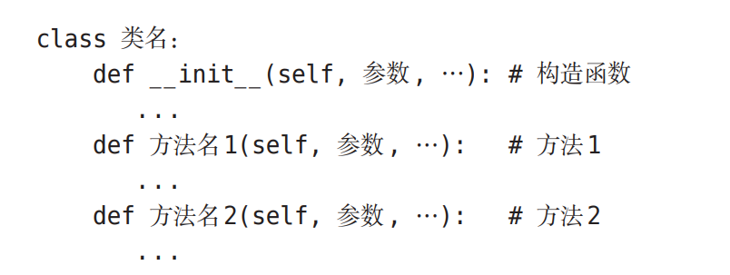
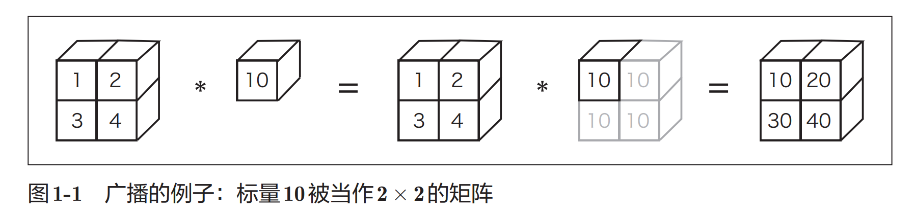
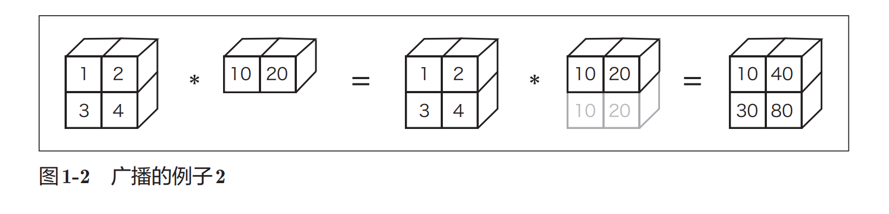
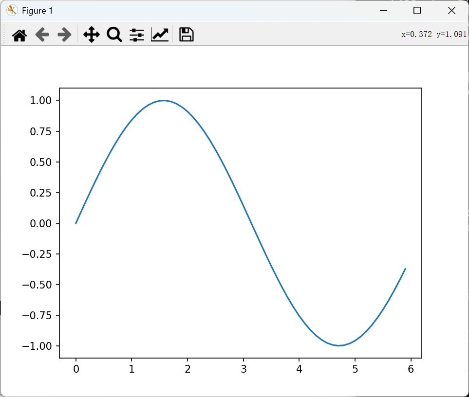
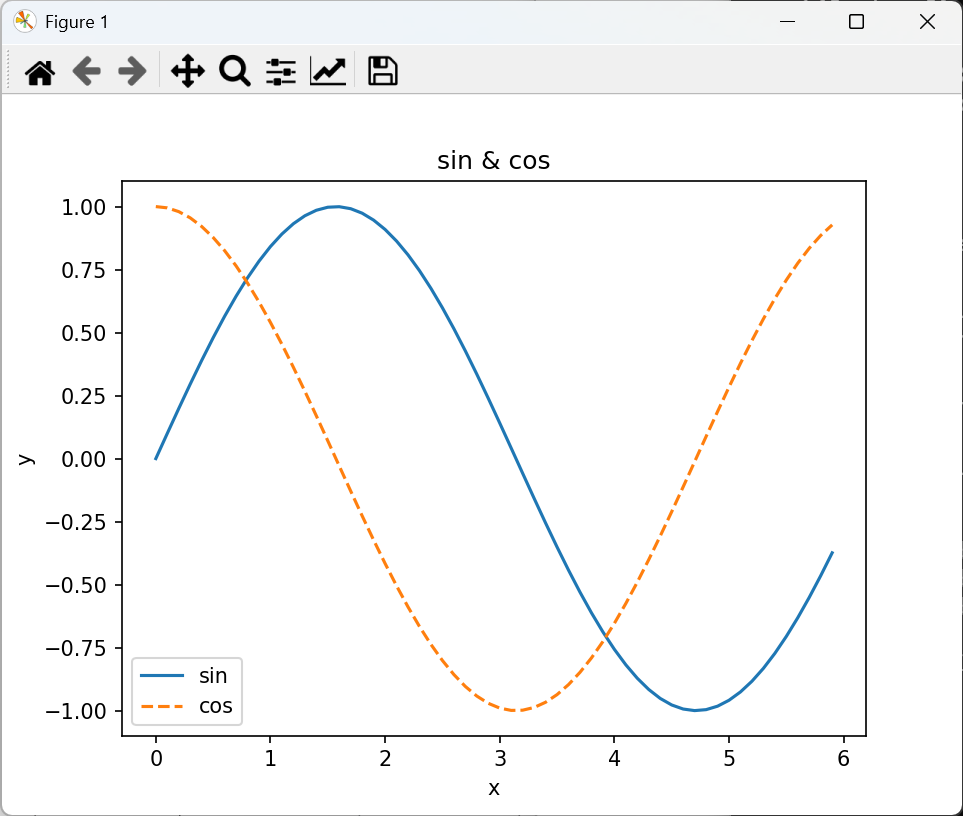
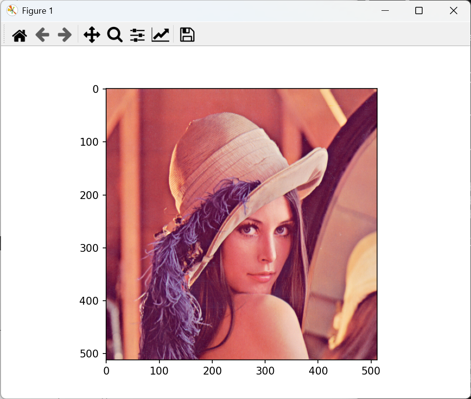

# 第01章：Python入门

## 1.1 Python是什么
**Python 的特点**

- 简单、易读、易记，开源免费，适合初学者入门。
- 可写可读性高的代码，也能处理大规模数据。
- 科学计算与深度学习领域常用（NumPy、TensorFlow 等）。
- 初学者到专业人士都适用，是学习深度学习的理想工具。

## 1.2 Python的安装

本书将使用下列编程语言和库：

- Python 3.x（截至 2016 年 8 月最新版本为 3.5）
- NumPy
- Matplotlib

## 1.3 Python解释器

版本确认：



输入python，启动Python解释器。



Python解释器也被称为“对话模式”，用户能够以和Python对话的方式 进行编程。

### 1.3.1 算数计算

加法或乘法等算术计算，可按如下方式进行：

```python
>>> 1+2
3
>>> 4*5
20
>>> 7/5
1.4
>>> 3**2
9
```

### 1.3.2 数据类型

编程中有数据类型（data type）这一概念。数据类型表示数据的性质， 有整数、小数、字符串等类型。Python中的type()函数可以用来查看数据 类型。

```python
>>> type(10)
<class 'int'>
>>> type(2.718)
<class 'float'>
>>> type("nihao")
<class 'str'>
```

### 1.3.3 变量

可以使用x或y等字母定义变量（variable）。此外，可以使用变量进行计算， 也可以对变量赋值。

```python
>>> x = 10 # 初始化
>>> print(x) # 输出 x
10
>>> x = 100 # 赋值
>>> print(x)
100
>>> y = 3.14
>>> x*y
314.0
>>> type(x*y)
<class 'float'>
```

Python是属于“动态类型语言”的编程语言，所谓动态，是指变量的类 型是根据情况自动决定的。在上面的例子中，用户并没有明确指出“x的类 型是int（整型）”，是Python根据x被初始化为10，从而判断出x的类型为 int的。

### 1.3.4 列表

除了单一的数值，还可以用列表（数组）汇总数据。

```python
>>> a = [1, 2, 3, 4, 5] # 生成列表
>>> print(a) # 输出列表的内容
[1, 2, 3, 4, 5]
>>> len(a) # 获取列表的长度
5
>>> a[0] # 访问第一个元素的值
1
>>> a[4]
5
>>> a[4] = 99 # 赋值
>>> print(a)
[1, 2, 3, 4, 99]
```

元素的访问是通过a[0]这样的方式进行的。[]中的数字称为索引（下标）， 索引从0开始（索引0对应第一个元素）。此外，Python的列表提供了**切片** （slicing）这一便捷的标记法。使用切片不仅可以访问某个值，还可以访问列 表的子列表（部分列表）。

```python
>>> print(a)
[1, 2, 3, 4, 99]
>>> a[0:2] # 获取索引为0到2（不包括2！）的元素
[1, 2]
>>> a[1:] # 获取从索引为1的元素到最后一个元素
[2, 3, 4, 99]
>>> a[:3]  # 获取从第一个元素到索引为3（不包括3！）的元素
[1, 2, 3]
>>> a[:-1] # 获取从第一个元素到最后一个元素的前一个元素之间的元素
[1, 2, 3, 4]
>>> a[:-2] # 获取从第一个元素到最后一个元素的前二个元素之间的元素
[1, 2, 3]
```

### 1.3.5 字典

列表根据索引，按照0, 1, 2, ...的顺序存储值，而字典则以键值对(key:value)的形式存储数据。字典就像《新华字典》那样，将单词和它的含义对应着存储起来。

```python
>>> me = {'height':180} # 生成字典
>>> me['height']	# 访问元素
180
>>> me['weight'] = 80 # 添加新元素
>>> print(me)
{'height': 180, 'weight': 80}
```

### 1.3.6 布尔型

Python中有bool型。bool型取True或False中的一个值。针对bool型的运算符包括and、or和not（针对数值的运算符有+、-、*、/等，根据不同的数据类型使用不同的运算符）。

```python
>>> hungry =  True # 饿了？
>>> sleepy = False # 困了？
>>> type(hungry)
<class 'bool'>
>>> not hungry
False
>>> hungry and sleepy # 饿并且困
False
>>> hungry or sleepy # 饿或者困
True
```

### 1.3.7 if语句

根据不同的条件选择不同的处理分支时可以使用if/else语句。

```python
>>> hungry =  True
>>> if hungry:
...     print("I'm hungry") # 使用空白字符进行缩进
... else:
...     print("I'm not hungry")
...     print("I'm sleepy")
...
I'm hungry
```

Python中的空白字符具有重要的意义。上面的if语句中，if hungry:下面 的语句开头有**4个空白字符**。它是缩进的意思，表示当前面的条件（if hungry） 成立时，此处的代码会被执行。这个缩进也可以用tab表示，Python中推荐 使用空白字符。

### 1.3.8 for 语句

进行循环处理时可以使用for语句。

```python
>>> for i in [1, 2, 3]:
...     print(i)
...
1
2
3
```

### 1.3.9 函数

可以将一连串的处理定义成**函数**（function）。

```python
>>> def hello():
...     print("Hello Kitty!")
...
>>> hello()
Hello Kitty!
```

此外，函数可以取参数

```python
>>> def hello(object):
...     print("Hello " + object + "!")
...
>>> hello("Cat")
Hello Cat!
```

另外，字符串的拼接可以使用+。 

关闭Python解释器时，Linux或Mac OS X的情况下输入Ctrl-D（按住Ctrl，再按D键）；Windows的情况下输入Ctrl-Z，然后按Enter键。

## 1.4 Python脚本文件

### 1.4.1 保存为文件

打开文本编辑器，新建一个hungry.py的文件。hungry.py只包含下面一行语句。

```python
print("I'm hungry and sleepy!")
```

接着，打开终端（Windows中的命令行窗口），移至hungry.py所在的位置。然后，将hungry.py文件名作为参数，运行python命令。这里假设hungry.py在 ~/deep-learning-from-scratch/ch01目录下（在本书提供的源代码中，hungry.py文件位于ch01目录下）。

```bash
(base) PS F:\a-deeplearning-from-scratch> cd .\ch01\
(base) PS F:\a-deeplearning-from-scratch\ch01> python .\hungry.py
I'm hungry and sleepy!
```

这样，使用python hungry.py命令就可以执行这个Python程序了。

### 1.4.2 类

现在，我们来定义新的类。如果用户自己定义类的话，就可以自己创建数据类型。此外，也可以定义原创的方法（类的函数）和属性。 

Python中使用class关键字来定义类，类要遵循下述格式（模板）。



这里有一个特殊的\__init__方法，这是进行初始化的方法，也称为**构造函数**（constructor）,只在生成类的实例时被调用一次。此外，在方法的第一个参数中明确地写入表示自身（自身的实例）的self是Python的一个特点。

下面我们通过一个简单的例子来创建一个类。这里将下面的程序保存为`man.py`。

```python
class Man:
    def __init__(self, name):
        self.name = name
        print("Initialized!")

    def hello(self):
        print("Hello " + self.name + "!")

    def goodbye(self):
        print("Good-bye " + self.name + "!")

m = Man("Liam")
m.hello()
m.goodbye()
```

从终端运行`man.py`。

```bash
(base) PS F:\a-deeplearning-from-scratch\ch01> python .\man.py
Initialized!
Hello Liam!
Good-bye Liam!
```

这里我们定义了一个新类Man。上面的例子中，类Man生成了实例（对象）m。

## 1.5 NumPy

在深度学习的实现中，经常出现数组和矩阵的计算。`NumPy`的数组类（numpy.array）中提供了很多便捷的方法，在实现深度学习时，我们将使用这些方法。

### 1.5.1 导入NumPy

NumPy是外部库。这里所说的“外部”是指不包含在标准版Python中。因此，我们首先要导入NumPy库。

```python
>>> import numpy as np
```

Python 中使用 import语句来导入库。这里的 import numpy as np，直译的话就是“将numpy作为np导入”的意思。通过写成这样的形式，之后`NumPy`相关的方法均可通过`np`来调用。

### 1.5.2 生成NumPy数组

要生成`NumPy数组`，需要使用`np.array()`方法。`np.array()`接收Python列表作为参数，生成`NumPy数组`（numpy.ndarray）。

```python
>>> x = np.array([1.0, 2.0, 3.0])
>>> print(x)
[1. 2. 3.]
>>> type(x)
<class 'numpy.ndarray'>
```


### 1.5.3 NumPy 的算术运算

```python
>>> x = np.array([1.0, 2.0, 3.0])
>>> y = np.array([2.0, 4.0, 6.0])
>>> x + y # 对应元素的加法
array([3., 6., 9.])
>>> x - y
array([-1., -2., -3.])
>>> x * y # element-wise product
array([ 2.,  8., 18.])
>>> x / y
array([0.5, 0.5, 0.5])
```

当x和y的元素个数相同时，可以对各个元素进行算术运算。如果元素个数不同，程序就会报错，所以元素个数保持一致非常重要。

另外，“对应元素的”的英文是`element-wise`，比如“对应元素的乘法”就是`element-wise product`。

`NumPy`数组不仅可以进行`element-wise`运算，也可以和单一的数值（标量）组合起来进行运算。此时，需要在NumPy数组的各个元素和标量之间进行运算。

这个功能也被称为**广播**（详见后文）

```python
>>> x = np.array([1.0, 2.0, 3.0])
>>> x / 2.0
array([0.5, 1. , 1.5])
```

### 1.5.4 NumPy的N维数组

NumPy不仅可以生成一维数组（排成一列的数组），也可以生成多维数组。比如，可以生成如下的二维数组（矩阵）

```python
>>> A = np.array([[1, 2], [3, 4]])
>>> print(A)
[[1 2]
 [3 4]]
>>> A.shape
(2, 2)
>>> A.dtype
dtype('int32')
```

这里生成了一个2 × 2的矩阵A。另外，矩阵A的形状可以通过`shape`查看，矩阵元素的数据类型可以通过`dtype`查看。下面，我们来看一下矩阵的算术运算。

```python
>>> B = np.array([[3, 0],[0, 6]])
>>> A + B
array([[ 4,  2],
       [ 3, 10]])
>>> A * B
array([[ 3,  0],
       [ 0, 24]])
```

和数组的算术运算一样，矩阵的算术运算也可以在相同形状的矩阵间以对应元素的方式进行。并且，也可以通过标量（单一数值）对矩阵进行算术运算。这也是基于广播的功能。

```python
>>> print(A)
[[1 2]
 [3 4]]
>>> A * 10
array([[10, 20],
       [30, 40]])
```

NumPy数组（np.array）可以生成N维数组，即可以生成一维数组、二维数组、三维数组等任意维数的数组。数学上将一维数组称为**向量**，将二维数组称为**矩阵**。另外，可以将一般化之后的向量或矩阵等统称为**张量**（tensor）。本书基本上将二维数组称为“矩阵”，将三维数组及三维以上的数组称为“张量”或“多维数组”。

### 1.5.5 广播

NumPy中，形状不同的数组之间也可以进行运算。之前的例子中，在2×2的矩阵A和标量10之间进行了乘法运算。在这个过程中，如图1-1所示，标量10被扩展成了2 × 2的形状，然后再与矩阵A进行乘法运算。这个巧妙的功能称为**广播**（broadcast）。



我们通过下面这个运算再来看一个广播的例子。

```python
>>> A = np.array([[1, 2], [3, 4]])
>>> B = np.array([10, 20])
>>> A * B
array([[10, 40],
       [30, 80]])
```

在这个运算中，如图1-2所示，一维数组B被“巧妙地”变成了和二维数组A相同的形状，然后再以对应元素的方式进行运算。

综上，因为NumPy有广播功能，所以不同形状的数组之间也可以顺利地进行运算。



### 1.5.6 访问元素

元素的索引从0开始。对各个元素的访问可按如下方式进行。

```python
>>> X = np.array([[51, 55], [14, 19], [0, 4]])
>>> print(X)
[[51 55]
 [14 19]
 [ 0  4]] 
>>> X[0] # 第0行
array([51, 55])
>>> X[0][1] # (0,1)的元素
55
```

也可以使用for语句访问各个元素。

```python
>>> for row in X:
...     print(row)
...
[51 55]
[14 19]
[0 4]
```

除了前面介绍的索引操作，NumPy还可以使用数组访问各个元素。

```python
>>> X = X.flatten() # 将X转换为一维数组
>>> print(X)
[51 55 14 19  0  4]
>>> X[np.array([0, 2, 4])] # 获取索引为0、2、4的元素
array([51, 14,  0])
```

运用这个标记法，可以获取满足一定条件的元素。例如，要从X中抽出大于15的元素，可以写成如下形式。

```python
>>> X > 15
array([ True,  True, False,  True, False, False])
>>> X[X>15]
array([51, 55, 19])
```

对NumPy数组使用不等号运算符等（上例中是X > 15）,结果会得到一个布尔型的数组。上例中就是使用这个布尔型数组取出了数组的各个元素（取出True对应的元素）。

## 1.6 Matplotlib

Matplotlib 是用于绘制图形的库，使用Matplotlib可以轻松地绘制图形和实现数据的可视化。

### 1.6.1 绘制简单图形

可以使用matplotlib的pyplot模块绘制图形。话不多说，我们来看一个绘制sin函数曲线的例子。

```python
import numpy as np
import matplotlib.pyplot as plt

# 生成数据
x = np.arange(0, 6, 0.1) # 以0.1为单位，生成0到6的数据
y = np.sin(x)

# 绘制图形
plt.plot(x, y)
plt.show()
```

这里使用NumPy的`arange`方法生成了[0, 0.1, 0.2, ..., 5.8, 5.9]的数据，将其设为x。对x的各个元素，应用NumPy的sin函数`np.sin()`，将x、y的数据传给`plt.plot`方法，然后绘制图形。最后，通过`plt.show()`显示图形。运行上述代码后，就会显示下图所示的图形。



### 1.6.2 pyplot的功能

在刚才的sin函数的图形中，我们尝试追加cos函数的图形，并尝试使用pyplot的添加标题和$x$轴标签名等其他功能。

```python
import numpy as np
import matplotlib.pyplot as plt

# 生成数据
x = np.arange(0, 6, 0.1) # 以0.1为单位，生成0到6的数据
y1 = np.sin(x)
y2 = np.cos(x)

# 绘制图形
plt.plot(x, y1, label="sin")
plt.plot(x, y2, linestyle = "--", label="cos") # 用虚线绘制
plt.xlabel("x") # x轴标签
plt.ylabel("y") # y轴标签
plt.title('sin & cos') # 标题
plt.legend()
plt.show()
```

结果如图所示，我们看到图的标题、轴的标签名都被标出来了。



### 1.6.3 显示图像

pyplot 中还提供了用于显示图像的方法 imshow()。另外，可以使用matplotlib.image模块的`imread()`方法读入图像。下面我们来看一个例子。

```python
import matplotlib.pyplot as plt
from matplotlib.image import imread

img = imread('lena.png') # 读入图像（设定合适的路径！）
plt.imshow(img)

plt.show()
```

运行上述代码后，会显示如图所示的图像。



这里，我们假定图像lena.png在当前目录下。

## 1.7 小结

- Python是一种简单易记的编程语言。
- Python是开源的，可以自由使用。
- 本书中将使用Python 3.x实现深度学习。
- 本书中将使用NumPy和Matplotlib这两种外部库。
- Python有“解释器”和“脚本文件”两种运行模式。
- Python能够将一系列处理集成为函数或类等模块。
- NumPy中有很多用于操作多维数组的便捷方法。