# 第02章：感知机

本章将介绍**感知机**（perceptron）这一算法。感知机是由美国学者Frank Rosenblatt在1957年提出来的。感知机也是作为神经网络（深度学习）的起源的算法。因此，学习感知机的构造也就是学习通向神经网络和深度学习的一种重要思想。

> 严格地讲，本章中所说的感知机应该称为“人工神经元”或“朴素感知机”，但是因为很多基本的处理都是共通的，所以这里就简单地称为“感知机”。

## 2.1 感知机是什么

### 感知机（Perceptron）

感知机是一种最基础的人工神经元模型，也是神经网络和深度学习的起点。
 它接收多个输入信号，并输出一个结果（0 或 1）。

- 0：不输出信号
- 1：输出信号

### 感知机的结构

一个简单的感知机通常包含：

- 输入信号：$x_1, x_2$
- 权重：$w_1, w_2$
- 阈值：$\theta$
- 输出：$y$

输入信号会先与对应权重相乘，再进行求和：
$$
w_1x_1 + w_2x_2
$$
当结果超过阈值时，输出1；否则输出0。

感知机具体结构如图2-1所示。

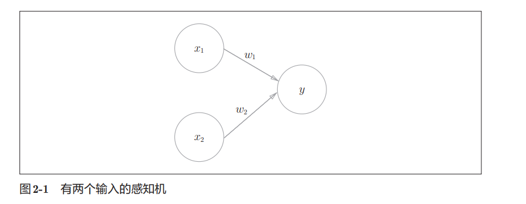

### 感知机的数学表达

$$
y =
\begin{cases}
1 & (w_1x_1 + w_2x_2 > \theta) \\
0 & (w_1x_1 + w_2x_2 \leq \theta)
\end{cases}
$$

### 核心概念

#### 1. 权重（Weight）

权重用于表示输入信号的重要程度。

- 权重越大，对结果影响越大
- 权重越小，影响越弱

------

#### 2. 阈值（Threshold）

阈值决定神经元是否被激活。

可以理解为：

> “达到条件才允许输出信号”

### 我的理解

感知机本质上是在做：

> “加权求和后进行条件判断”

流程：

```
输入信号
   ↓
乘以权重
   ↓
求和
   ↓
与阈值比较
   ↓
输出0或1
```

### 类比理解

书中将权重类比为电路中的“电阻”。

我的理解：

- 权重大 → 信号更容易通过
- 权重小 → 信号影响较弱

作用本质上都是：

> 控制信号的强弱与流动程度

### 小结

- 感知机是神经网络的基础
- 本质是一个“线性分类器”
- 核心步骤：
  1. 输入信号
  2. 加权求和
  3. 超过阈值则激活输出
- 权重决定重要性，阈值决定是否激活

## 2.2 简单逻辑电路

### 2.2.1 与门（AND Gate）

#### 核心概念

- 与门有两个输入 $x_1, x_2$ 和一个输出 $y$

- 与门的真值表：

  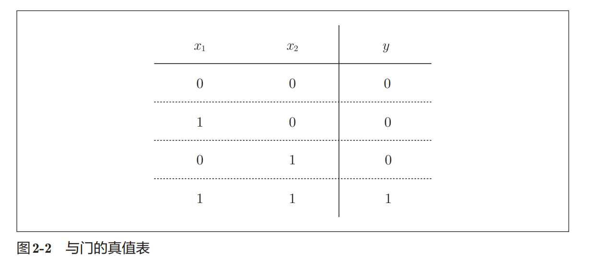

- 输出1仅当两个输入都为1

#### 感知机表示

感知机可以模拟与门：
$$
y =
\begin{cases}
1 & (w_1 x_1 + w_2 x_2 > \theta) \\
0 & \text{否则}
\end{cases}
$$
参数选择示例：

- $(w_1, w_2, \theta) = (0.5, 0.5, 0.7)$
- $(w_1, w_2, \theta) = (0.5, 0.5, 0.8)$
- $(w_1, w_2, \theta) = (1.0, 1.0, 1.0)$

只要加权和超过阈值 $θ$，输出为1；否则输出0。

------

#### 我的理解

- 与门 = **线性可分问题**
- 关键在于选定权重和阈值，使只有 $(1,1)$ 时输出1
- 感知机参数不是唯一，有多组可行解

### 2.2.2 与非门和或门

#### 与非门（NAND Gate）

与非门（NAND）可以理解为：

> 对与门结果取反

真值表如下：

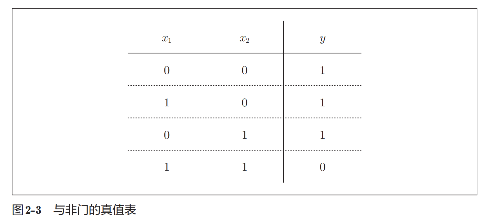

特点：

- 只有两个输入都为1时输出0
- 其余情况输出1

参数示例：
$$
(w_1, w_2, \theta) = (-0.5, -0.5, -0.7)
$$

------

#### 或门（OR Gate）

或门表示：

> 只要有一个输入为1，输出就为1

真值表如下：

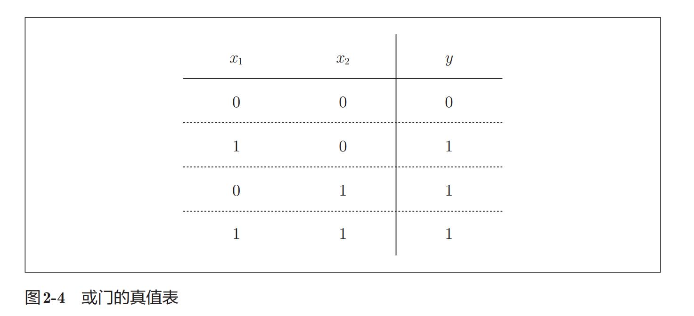

参数示例：
$$
(w_1, w_2, \theta) = (1, 1, 0.5)
$$

------

#### 我的理解

##### 1. 不同逻辑门，本质结构相同

与门、与非门、或门：

- 感知机结构完全一致
- 区别仅在于：
  - 权重 $w$
  - 阈值 $\theta$

即：

> 同一个模型，通过修改参数即可实现不同功能

------

##### 2. 参数并不是唯一的

满足条件的参数组合有很多组。

例如：

- 与门
- 与非门
- 或门

都存在无数种参数解。

------

##### 3. 机器学习的核心思想

当前这些参数是：

> 人工手动设定的

而机器学习希望做到：

> 让计算机自动学习出合适的参数

##### 4. 感知机的作用

感知机就像一个：

> “可调参数的逻辑判断器”

结构固定：

```
输入 → 加权求和 → 阈值判断 → 输出
```

通过修改权重和阈值：

- 可以变成与门
- 可以变成或门
- 也可以变成与非门

这也是神经网络最基础的思想。

## 2.3 感知机的实现

### 2.3.1 简单的实现

#### 使用 Python 实现与门

用 Python 可以很容易实现一个简单的感知机与门。

```python
def AND(x1, x2):
    w1, w2, theta = 0.5, 0.5, 0.7

    # 计算加权和
    tmp = x1 * w1 + x2 * w2

    # 超过阈值则输出1
    if tmp > theta:
        return 1
    else:
        return 0
```

------

#### 代码分析

##### 参数含义

- `w1`, `w2`：权重（输入的重要程度）
- `theta`：阈值
- `tmp`：输入信号的加权总和

计算公式：
$$
tmp = x_1 w_1 + x_2 w_2
$$

------

#### 测试结果

```python
AND(0, 0) # 0
AND(1, 0) # 0
AND(0, 1) # 0
AND(1, 1) # 1
```

结果与与门真值表一致：

| x1   | x2   | 输出 |
| ---- | ---- | ---- |
| 0    | 0    | 0    |
| 1    | 0    | 0    |
| 0    | 1    | 0    |
| 1    | 1    | 1    |

### 2.3.2 导入权重和偏置

前面使用的是：
$$
w_1x_1 + w_2x_2 > \theta
$$
为了后续更方便地表示感知机，书中将阈值 $\theta$ 改写为偏置 $b$：
$$
w_1x_1 + w_2x_2 + b > 0
$$
其中：

- $w_1, w_2$：权重（weight）
- $b$：偏置（bias）

虽然只是符号变化，但这种写法更加统一，也是后续神经网络中的标准形式。

---

#### 使用 NumPy 实现

```python
>>> import numpy as np
>>> x = np.array([0, 1]) # 输入
>>> w = np.array([0.5, 0.5]) # 权重
>>> b = -0.7 # 偏置
>>> w*x
array([0. , 0.5])
>>> np.sum(w*x)
0.5
>>> np.sum(w*x) + b
-0.19999999999999996 # 大约为-0.2（由浮点小数造成的运算误差）
```


#### 代码分析

##### 1. NumPy 的数组乘法

```
w * x
```

会进行：

```
对应元素相乘
```

即：
$$
[0,1] * [0.5,0.5]
=
[0,0.5]
$$

------

##### 2. np.sum()

```
np.sum(w * x)
```

用于计算数组元素总和：
$$
0 + 0.5 = 0.5
$$

------

##### 3. 偏置的作用

最后：
$$
w_1x_1 + w_2x_2 + b
$$
如果结果大于0，则输出1；否则输出0。

偏置可以理解为：

> 调整神经元“容易被激活”的程度

- 偏置越大，越容易输出1
- 偏置越小，越难激活

### 2.3.3 使用权重和偏置的实现

使用权重（weight）和偏置（bias）后，可以更统一地实现感知机逻辑门。

---

#### 与门（AND）

```python
import numpy as np

def AND(x1, x2):
    x = np.array([x1, x2])

    # 权重
    w = np.array([0.5, 0.5])

    # 偏置
    b = -0.7

    # 加权求和 + 偏置
    tmp = np.sum(w * x) + b

    # 激活判断
    if tmp <= 0:
        return 0
    else:
        return 1
```

------

#### 权重与偏置的区别

##### 权重（w）

权重决定：

> 输入信号的重要程度

- 权重大 → 输入影响更大
- 权重小 → 输入影响更小

------

##### 偏置（b）

偏置决定：

> 神经元“多容易被激活”

例如：

- ```python
  b = -0.1
  ```

  - 很容易输出1

- ```python
  b = -20
  ```

  - 必须有非常大的输入才能激活

可以把偏置理解为：

```
神经元的启动门槛
```

---

#### 与非门（NAND）

```python
def NAND(x1, x2):
    x = np.array([x1, x2])

    w = np.array([-0.5, -0.5]) # 仅权重和偏置与AND不同！
    b = 0.7

    tmp = np.sum(w * x) + b

    if tmp <= 0:
        return 0
    else:
        return 1
```

------

#### 或门（OR）

```python
def OR(x1, x2):
    x = np.array([x1, x2])

    w = np.array([0.8, 0.8]) # 仅权重和偏置与AND不同！
    b = -0.7

    tmp = np.sum(w * x) + b

    if tmp <= 0:
        return 0
    else:
        return 1
```

------

#### 本节重点

与门、与非门、或门：

- 代码结构完全一致
- 不同点仅在于：
  - 权重 `w`
  - 偏置 `b`

也就是说：

> 同一个感知机模型，只需要修改参数，就能实现不同逻辑功能。

------

#### 结构统一后的感知机流程

```
输入 x
 ↓
乘以权重 w
 ↓
求和
 ↓
加上偏置 b
 ↓
判断是否大于0
 ↓
输出结果
```

这种“统一结构 + 不同参数”的思想，也是后续神经网络的重要基础。

## 2.4 感知机的局限性

### 2.4.1 异或门（XOR Gate）

异或门（XOR）表示：

> 两个输入不同则输出1，相同则输出0

真值表：

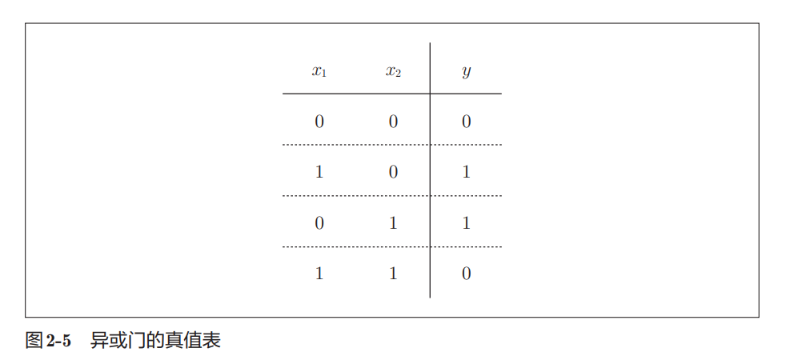

#### 为什么感知机无法实现异或门？

前面介绍的 AND、OR、NAND 都可以通过：

```
一条直线
```

将输出0和输出1的数据分开。

例如 OR 门：
$$
-0.5 + x_1 + x_2 = 0
$$
这条直线可以将：

- 输出0的数据
- 输出1的数据

正确划分到不同区域。

------

#### OR 门的空间划分

下图中：

- 〇 表示输出0
- △ 表示输出1

可以看到：

> 一条直线就能完成分类

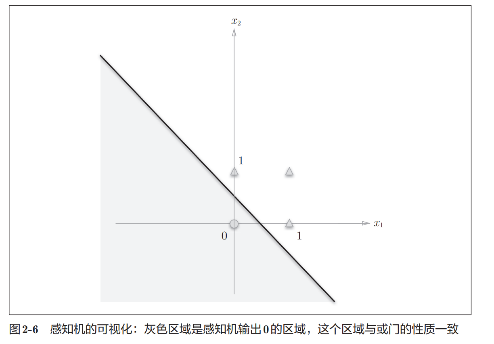

#### XOR 门的问题

对于 XOR 门：

- (0,0) 和 (1,1) 输出0
- (0,1) 和 (1,0) 输出1

分布如下：

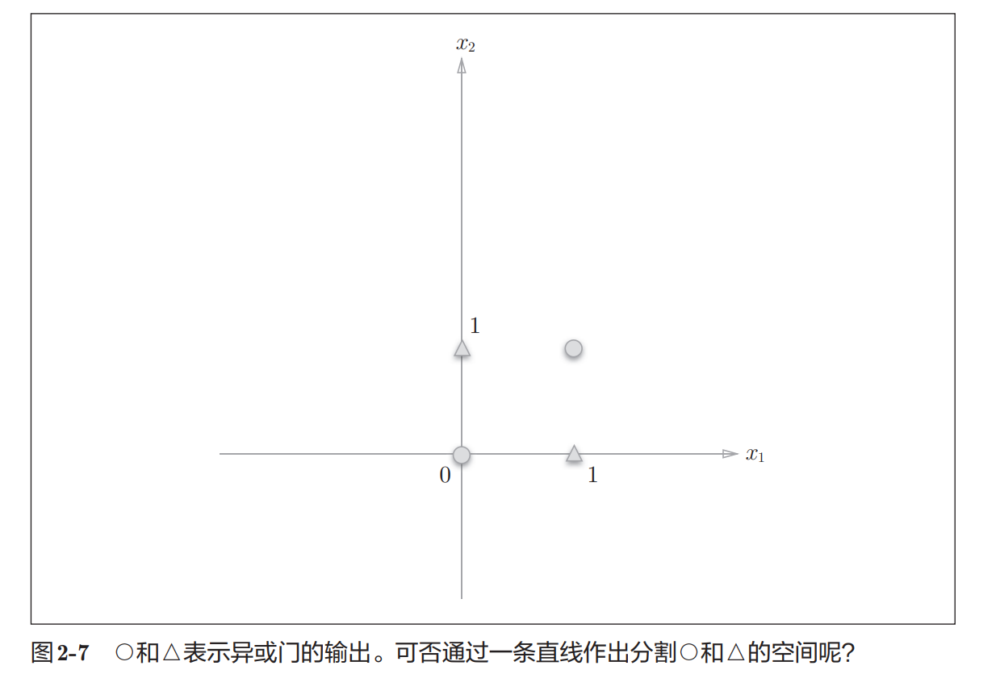

此时会发现：

> 无法只用一条直线把 ○ 和 △ 分开

也就是说：

```
XOR 不是线性可分问题
```

#### 单层感知机的局限性

前面的感知机本质上只能做到：

> 用一条直线进行分类

因此：

- AND 可以实现
- OR 可以实现
- NAND 可以实现
- XOR 无法实现

### 2.4.2 线性和非线性

在上一节中，XOR 门无法用一条直线完成分类。
但如果不再限制必须使用“直线”，问题就可以解决。

例如，可以使用曲线将数据划分开：

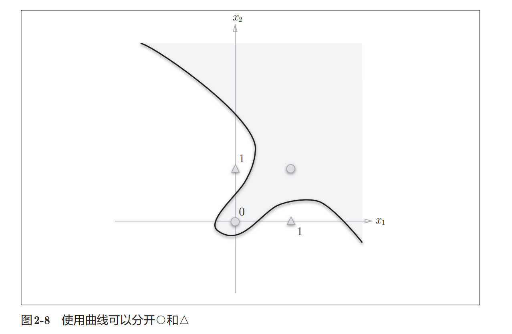

#### 线性空间与非线性空间

##### 线性空间（Linear）

如果数据能够被：

```
一条直线
```

分开，就称为：

```
线性可分
```

例如：

- AND
- OR
- NAND

都属于线性可分问题。

------

##### 非线性空间（Non-linear）

如果必须使用：

```
曲线
```

才能完成分类，则属于：

```
非线性问题
```

XOR 就是典型的非线性问题。

## 2.5 多层感知机

虽然单层感知机无法实现 XOR（异或门），但通过：

```
组合多个感知机
```

就能够解决这个问题。

这也是：

> 多层感知机（Multi-Layer Perceptron）

的核心思想。

### 2.5.1 已有门电路的组合

前面已经实现了：

- AND
- NAND
- OR

现在，可以将这些逻辑门组合起来实现 XOR。

#### 逻辑门符号

常见逻辑门如下：

- AND：与门
- NAND：与非门
- OR：或门

其中：

```
NAND 门输出端的小圆圈○表示“取反”
```

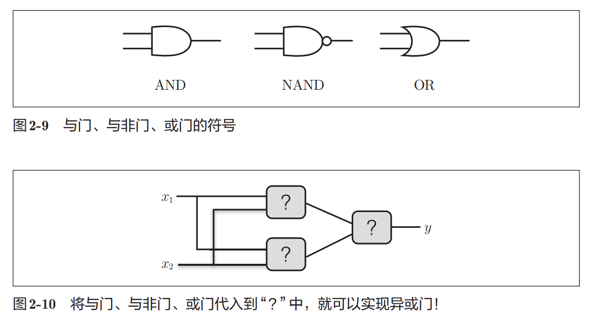

#### XOR 的实际结构

最终可以使用：

- NAND
- OR
- AND

三种门组合实现 XOR。

结构如下：

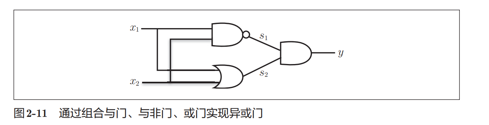

其中：

- $s_1$：NAND 输出
- $s_2$：OR 输出

最后：

- $s_1$
- $s_2$

一起输入 AND 门得到最终输出。

#### XOR 的计算流程

整体流程：

```
x1、x2
   ↓
NAND 与 OR
   ↓
得到 s1、s2
   ↓
AND
   ↓
输出 y
```

------

#### 真值表分析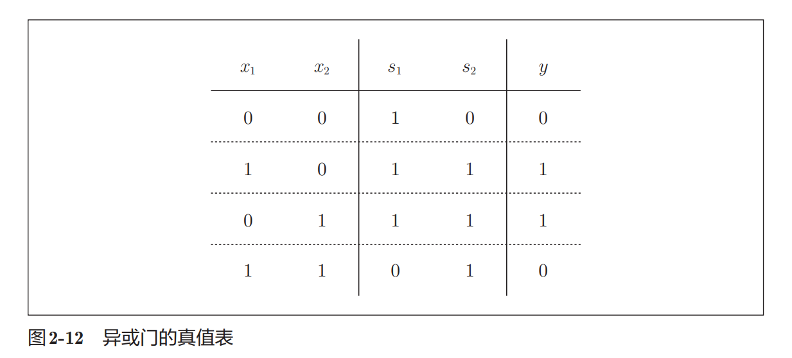

最终输出：

```
输入不同 → 输出1
输入相同 → 输出0
```

符合 XOR 的定义。

### 2.5.2 异或门的实现

前面已经知道：

- 单层感知机无法实现 XOR
- 但通过组合多个逻辑门，可以实现 XOR

因此，可以直接利用之前定义好的：

- `AND`
- `NAND`
- `OR`

来实现异或门。

---

#### XOR 的 Python 实现

```python
def XOR(x1, x2):
    s1 = NAND(x1, x2)
    s2 = OR(x1, x2)

    y = AND(s1, s2)

    return y
```

------

#### 测试结果

```python
XOR(0, 0) # 0
XOR(0, 1) # 1
XOR(1, 0) # 1
XOR(1, 1) # 0
```

结果符合 XOR 真值表。

#### 用感知机结构理解 XOR

如图2-13所示，异或门是一种多层结构的神经网络。这里，将最左边的 一列称为第0层，中间的一列称为第1层，最右边的一列称为第2层。

图2-13所示的感知机与前面介绍的与门、或门的感知机（图2-1）形状不同。实际上，与门、或门是单层感知机，而异或门是2层感知机。叠加了多层的感知机也称为**多层感知机**（multi-layered perceptron）

将 XOR 用“神经网络”的形式表示：

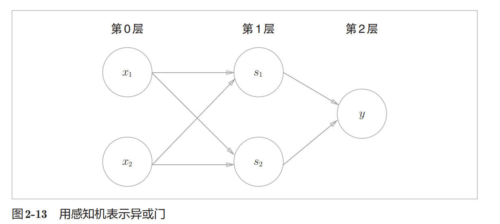

> 图 2-13中的感知机总共由 3层构成，但是因为拥有权重的层实质上只有2层（第0层和第1层之间，第1层和第2层之间），所以称为“2层感知机”。不过，有的文献认为图 2-13的感知机是由3层构成的，因而将其称为“3层感知机”

#### 多层结构

图中：

- 第0层：输入层
- 第1层：中间层（隐藏层）
- 第2层：输出层

数据流动过程：

```
输入层
  ↓
隐藏层
  ↓
输出层
```

------

#### XOR 的信号传递过程

##### 第一步：输入层

输入：
$$
x_1,\ x_2
$$
发送到第1层。

------

##### 第二步：隐藏层

第1层分别计算：

- `NAND(x1, x2)` → $s_1$
- `OR(x1, x2)` → $s_2$

得到中间结果：
$$
s_1,\ s_2
$$

------

##### 第三步：输出层

最后：

```
AND(s1, s2)
```

得到最终输出：
$$
y
$$

#### 单层 vs 多层

##### 单层感知机

只能解决：

```
线性可分问题
```

例如：

- AND
- OR
- NAND

------

##### 多层感知机

通过增加隐藏层：

```
能够处理非线性问题
```

例如：

- XOR

## 2.6 从与非门到计算机

多层感知机不仅可以实现：

- AND
- OR
- XOR

这样的简单逻辑门，还可以进一步实现：

- 加法器
- 编码器
- ALU（算术逻辑单元）
- 甚至计算机中的各种逻辑电路

#### 为什么感知机可以表示计算机？

因为：

```
计算机本质上也是输入 → 计算 → 输出
```

而逻辑电路本身可以由：

```
NAND（与非门）
```

组合实现。

又因为：

```
NAND 可以由感知机实现
```

所以理论上：

> 通过组合大量感知机，也能够构建计算机。

------

#### 多层感知机的重要意义

单层感知机：

```
只能表示线性问题
```

多层感知机：

```
能够表示复杂的非线性问题
```

理论上甚至可以表示任意函数。

------

#### 本节了解即可

书里这一节主要想表达：

> 感知机的表达能力其实非常强。

但这里不需要深入纠结：

- 如何真正构建计算机
- 如何设计 CPU
- 如何证明任意函数可表示

知道下面这句话即可：

```
通过增加层数，感知机的表达能力会大幅增强
```

这也是后续深度学习发展的基础。

## 2.7 小结

- 感知机是具有输入和输出的算法。给定一个输入后，将输出一个既定的值。
- 感知机将权重和偏置设定为参数。
- 使用感知机可以表示与门和或门等逻辑电路。
- 异或门无法通过单层感知机来表示。
- 使用2层感知机可以表示异或门。
- 单层感知机只能表示线性空间，而多层感知机可以表示非线性空间。
- 多层感知机（在理论上）可以表示计算机。