# 第03章：神经网络

感知机虽然具备表示复杂函数的能力，但存在一个关键问题：

- **权重需要人工设定**
- 面对复杂任务时，手动调整权重几乎不可行

神经网络的目标就是解决这个问题：

> **通过数据自动学习合适的权重参数**

这也是神经网络相比感知机最重要的提升。


## 3.1 从感知机到神经网络

神经网络和上一章介绍的感知机有很多共同点。这里，我们主要以两者 的差异为中心，来介绍神经网络的结构。

### 3.1.1 神经网络的例子

#### 神经网络结构

- **输入层**（Input Layer）
- **隐藏层 / 中间层**（Hidden Layer）
- **输出层**（Output Layer）

 图3-1中，第0层对应输入层，第1层对应中间层，第2层对应输出层。


#### 层编号

本书层号从 0 开始：

- 第0层：输入层
- 第1层：隐藏层
- 第2层：输出层

这样编号是为了后续 Python 实现方便。

#### 网络层数

图中共有：

- `3层`神经元
- 只有`2层`带权重的连接

因此本书称其为：

> 2层网络

计算方式：

```
网络层数 = 神经元总层数 - 1
```

### 3.1.2 复习感知机

感知机如图3-2中的网络结构。


#### 感知机公式

$$
y=
\begin{cases}
0 &(b+w_1x_1+w_2x_2 \le 0) \\
1 &(b+w_1x_1+w_2x_2 > 0)
\end{cases}
$$

---

#### 参数含义

- \($w_1,w_2$\)：权重
- \($b$\)：偏置

---

#### 偏置表示

为了区别于其他神经元，我们在图中把**偏置**神经元整个涂成灰色。


偏置可看作：

- 输入固定为 1
- 权重为 \(b\)

---

#### 函数形式改写

$$
y=h(b+w_1x_1+w_2x_2)
$$

其中：

$$
h(x)=
\begin{cases}
0 &(x \le 0) \\
1 &(x > 0)
\end{cases}
$$

---

#### 重点

- 感知机本质：加权求和后输出结果
- 使用 $h(x)$ 可简化公式表示

### 3.1.3 激活函数登场

#### 激活函数

$h(x)$ 用于将输入信号总和转换为输出。

作用：

- 决定如何激活输入信号总和

#### 分阶段表示

先计算加权总和：
$$
a=b+w_1x_1+w_2x_2
$$
再通过函数转换输出：
$$
y=h(a)
$$

------

#### 计算过程


- 节点 $a$：输入信号加权总和
- 节点 $y$：函数转换后的输出

#### 神经元表示


通常：

- 左图：简化表示
- 右图：明确显示函数计算过程

#### 重点

- 激活函数连接感知机与神经网络
- 神经网络本质：加权求和 + 激活函数
- 本书中“节点”与“神经元”含义相同

------

>  补充
>
> - 单层感知机：使用阶跃函数
> - 多层感知机：使用平滑激活函数（如 sigmoid）

## 3.2 激活函数

#### 阶跃函数

阶跃函数：

- 超过阈值输出1
- 否则输出0

感知机使用的就是阶跃函数。

------

#### 神经网络

神经网络与感知机的关键区别：

- 将阶跃函数替换为其他激活函数

之后将介绍神经网络常用激活函数。

### 3.2.1 sigmoid函数

#### sigmoid函数

$$
h(x)=\frac{1}{1+\exp(-x)}
$$

其中：

- $\exp(-x)=e^{-x}$
- $e \approx 2.7182$

------

#### 特点

- 输入一个值
- 输出一个转换后的结果

例如：
$$
h(1.0)=0.731...
$$

------

#### 重点

- 神经网络常使用 sigmoid 函数作为激活函数
- 感知机与神经网络的重要区别：激活函数不同
- 其他结构（多层连接、信号传递）基本相同

### 3.2.2 阶跃函数的实现

#### 阶跃函数

```python
def step_function(x):
    if x > 0:
        return 1
    else:
        return 0
```

缺点：

- 只能处理单个实数
- 不支持 NumPy 数组

------

#### 支持 NumPy 的实现

```python
def step_function(x):
    y = x > 0
    return y.astype(np.int64)
```

------

#### NumPy比较运算

```python
>>> x = np.array([-1.0, 1.0, 2.0])
>>> x > 0

array([False,  True,  True])
```

数组每个元素都会进行比较。

------

#### astype()

```python
>>> y.astype(np.int64)

array([0, 1, 1], dtype=int64)
```

类型转换：

- `True → 1`
- `False → 0`

------

#### 重点

- NumPy 支持数组级运算
- `x > 0` 返回布尔数组
- `astype()` 可进行类型转换

### 3.2.3 阶跃函数的图形

#### 绘制阶跃函数

```python
import numpy as np
import matplotlib.pylab as plt

def step_function(x):
    return np.array(x > 0, dtype=np.int64)

x = np.arange(-5.0, 5.0, 0.1)
y = step_function(x)

plt.plot(x, y)
plt.ylim(-0.1, 1.1)
plt.show()
```

------

#### np.arange()

```python
np.arange(-5.0, 5.0, 0.1)
```

生成：

```python
[-5.0, -4.9, ..., 4.9]
```

------

#### 图像特点

- 以 0 为界
- 输出从 0 切换为 1
- 图像呈阶梯状

因此称为：

> 阶跃函数

对数组x、y进行绘图，结果如图所示。


### 3.2.4 sigmoid函数的实现

#### sigmoid函数实现

```python
def sigmoid(x):
    return 1 / (1 + np.exp(-x))
```

------

#### 支持 NumPy 数组

```python
>>> x = np.array([-1.0, 1.0, 2.0])
>>> sigmoid(x)

array([0.26894142, 0.73105858, 0.88079708])
```

------

#### 广播机制

```python
>>> t = np.array([1.0, 2.0, 3.0])

>>> 1.0 + t
array([2., 3., 4.])

>>> 1.0 / t
array([1.        , 0.5       , 0.33333333])
```

标量会自动与数组各元素运算。

------

#### 绘制 sigmoid 函数

```python
import numpy as np
import matplotlib.pylab as plt

def sigmoid(x):
    return 1 / (1 + np.exp(-x))

x = np.arange(-5.0, 5.0, 0.1)
y = sigmoid(x)

plt.plot(x, y)
plt.ylim(-0.1, 1.1)
plt.show()
```

------

#### sigmoid函数图像


#### 图像特点

- 曲线平滑
- 输出范围：(0, 1)
- 输入越大，越接近 1
- 输入越小，越接近 0

### 3.2.5 sigmoid函数和阶跃函数的比较

#### 对比图


#### 不同点

##### 阶跃函数

- 输出只有 0 或 1
- 变化不连续

##### sigmoid函数

- 输出为连续实数
- 曲线平滑

------

#### 共同点

- 输入小时，输出接近 0
- 输入大时，输出接近 1
- 输出范围都在 $(0,1)$ 之间

------

#### 重点

- 神经网络更常使用平滑的 sigmoid 函数
- sigmoid 的平滑性对神经网络学习很重要

### 3.2.6 非线性函数

#### 非线性函数

- 阶跃函数：阶梯状
- sigmoid函数：曲线状

两者都属于：

> 非线性函数

------

#### 线性函数

线性函数：
$$
h(x)=cx
$$
特点：

- 图像是一条直线

------

#### 为什么不能使用线性函数

若使用线性函数：
$$
h(x)=cx
$$
三层网络：
$$
y(x)=h(h(h(x)))
$$
实际仍可化简为：
$$
y(x)=ax
$$
其中：
$$
a=c^3
$$

------

#### 重点

- 使用线性函数时，多层网络等价于单层网络
- 无法发挥“增加层数”的意义
- 神经网络必须使用非线性函数

### 3.2.7 ReLU函数

#### ReLU函数

$$
h(x)=
\begin{cases}
x &(x>0) \\
0 &(x\le0)
\end{cases}
$$

------

#### 图像

#### 特点

- 输入大于 0：直接输出
- 输入小于等于 0：输出 0

------

#### 实现

```python
def relu(x):
    return np.maximum(0, x)
```

------

#### np.maximum()

```python
np.maximum(a, b)
```

返回两个值中较大的值。

------

#### 重点

- ReLU 是目前常用激活函数
- 结构简单
- 后续章节会大量使用 ReLU 函数

## 3.3 多维数组的运算

如果掌握了NumPy多维数组的运算，就可以高效地实现神经网络。因此，本节将介绍NumPy多维数组的运算，然后再进行神经网络的实现。

### 3.3.1 多维数组

#### 一维数组

```python
>>> A = np.array([1, 2, 3, 4])

>>> np.ndim(A)
1

>>> A.shape
(4,)

>>> A.shape[0]
4
```

- `np.ndim()`：查看维数
- `shape`：查看数组形状

------

#### 二维数组

```python
>>> B = np.array([
... [1, 2],
... [3, 4],
... [5, 6]
... ])

>>> np.ndim(B)
2

>>> B.shape
(3, 2)
```

表示：

- 3 行
- 2 列

#### 行与列


- 横向：行（row）
- 纵向：列（column）

------

#### 重点

- 多维数组是数字的集合
- 二维数组也称为矩阵（matrix）
- `shape` 返回结果为元组（tuple）

### 3.3.2 矩阵乘法

#### 矩阵乘法


计算规则：

- 左矩阵的“行”
- 乘右矩阵的“列”
- 对应元素相乘后求和

------

#### NumPy实现

```python
>>> A = np.array([[1, 2], [3, 4]])
>>> B = np.array([[5, 6], [7, 8]])

>>> np.dot(A, B)

array([[19, 22],
       [43, 50]])
```

---

#### 可拆分理解（我倾向的理解方式）

矩阵乘法可理解为：
$$
\begin{bmatrix}
1 & 2 \\
3 & 4
\end{bmatrix}
\begin{bmatrix}
5 & 6 \\
7 & 8
\end{bmatrix}
=
\begin{bmatrix}
1 \\
3
\end{bmatrix}
[5\ 6]
+
\begin{bmatrix}
2 \\
4
\end{bmatrix}
[7\ 8]
$$
即：

- 左矩阵按**列**拆
- 右矩阵按**行**拆
- 多个外积相加

这种理解在线性代数和深度学习里非常常见。


#### shape规则

矩阵乘法要求：

```python
左矩阵列数 == 右矩阵行数
```

例如：

```python
(3×2) · (2×4) → (3×4)
```

结果shape：

```python
结果行数来自左矩阵
结果列数来自右矩阵
```

------

#### 一维数组情况


```python
>>> A.shape
(3, 2)

>>> B.shape
(2,)
>>> np.dot(A, B)

array([23, 53, 83])
```

------

#### 一维数组本质

- `(2,)` 本质是一维数组
- 不是严格行向量/列向量

真正列向量：

```python
[[7],
 [8]]
```

shape：

```python
(2,1)
```

真正行向量：

```python
[[7,8]]
```

shape：

```python
(1,2)
```

### 3.3.3 神经网络的内积

#### 神经网络矩阵表示


- 输入：$X$
- 权重：$W$
- 输出：$Y$

------

#### shape

```python
X : (2,)
W : (2,3)
Y : (3,)
```

矩阵乘法要求：

```python
X 的元素个数
=
W 的行数
```

------

#### NumPy实现

```python
>>> X = np.array([1, 2])

>>> W = np.array([
... [1, 3, 5],
... [2, 4, 6]
... ])

>>> np.dot(X, W)

array([ 5, 11, 17])
```

------

#### 计算结果

$$
Y=
[
1\times1+2\times2,\ 
1\times3+2\times4,\ 
1\times5+2\times6
]
$$

------

#### 重点

- 神经网络计算本质是矩阵乘法
- `np.dot()` 可一次性完成多个节点计算
- 比逐个 `for` 计算效率更高

## 3.4 3层神经网络的实现

以图3-15的3层神经网络为对象，实现从输入到输出的（前向）处理。在代码实现方面，使用上一节介绍的NumPy多维数组。巧妙地使用NumPy数组，可以用很少的代码完成神经网络的前向处理。

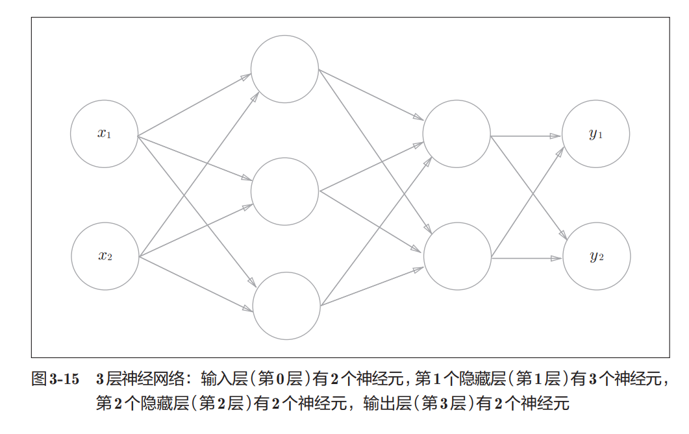

### 3.4.1 符号确认

#### 权重符号


$$
w_{12}^{(1)}
$$
含义：

- $(1)$：第1层权重
- 下标第1个数字：后一层神经元编号
- 下标第2个数字：前一层神经元编号

即：

$x_2$→ $a_1^{(1)}$ 的权重

------

#### 神经元符号

$$
a_1^{(1)}
$$

表示：

```
第1层的第1个神经元
```

------

#### 重点

- 右上角：层号
- 右下角：神经元编号
- 下标顺序：

```
后一层 → 前一层
```

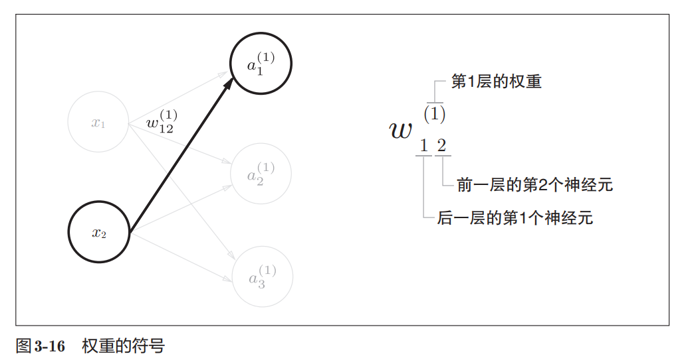

### 3.4.2 各层间信号传递的实现

#### 矩阵形式

$$
A^{(1)} = XW^{(1)} + B^{(1)}
$$

其中：
$$
A^{(1)}
=
\begin{pmatrix}
a_1^{(1)} & a_2^{(1)} & a_3^{(1)}\\
\end{pmatrix}\\
X
=
\begin{pmatrix}
x_1 & x_2\\
\end{pmatrix}\\
B^{(1)}
=
\begin{pmatrix}
b_1^{(1)} & b_2^{(1)} & b_3^{(1)}\\
\end{pmatrix}\\
W^{(1)} =
\begin{pmatrix}
w_{11}^{(1)} & w_{21}^{(1)} & w_{31}^{(1)} \\
w_{12}^{(1)} & w_{22}^{(1)} & w_{32}^{(1)} \\
\end{pmatrix}
$$

- 一层神经网络可整体写成矩阵形式
- 多个神经元可一次性并行计算
- 神经网络计算核心：

```python
A = XW + B
```

#### 输入层 → 第1层

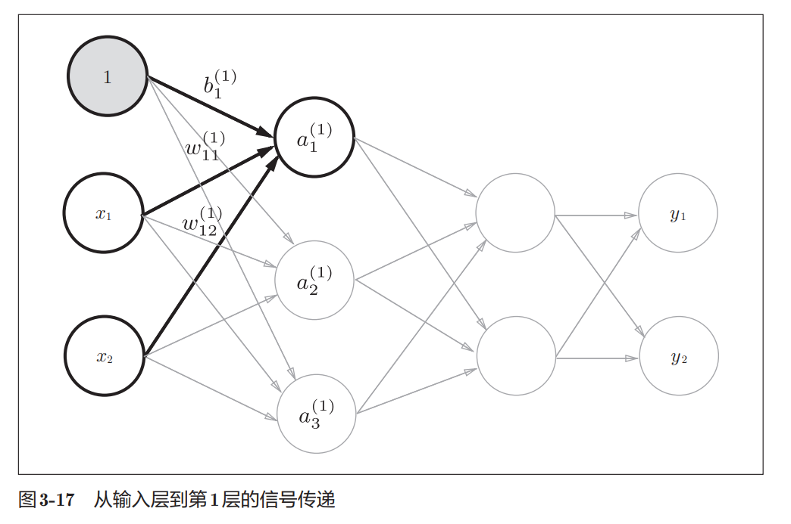


$$
a_1^{(1)}
=
w_{11}^{(1)}x_1
+
w_{12}^{(1)}x_2
+
b_1^{(1)}
$$

------

#### 矩阵表示

```python
X = np.array([1.0, 0.5])

W1 = np.array([
    [0.1, 0.3, 0.5],
    [0.2, 0.4, 0.6]
])

B1 = np.array([0.1, 0.2, 0.3])
A1 = np.dot(X, W1) + B1
```

------

#### 第1层激活

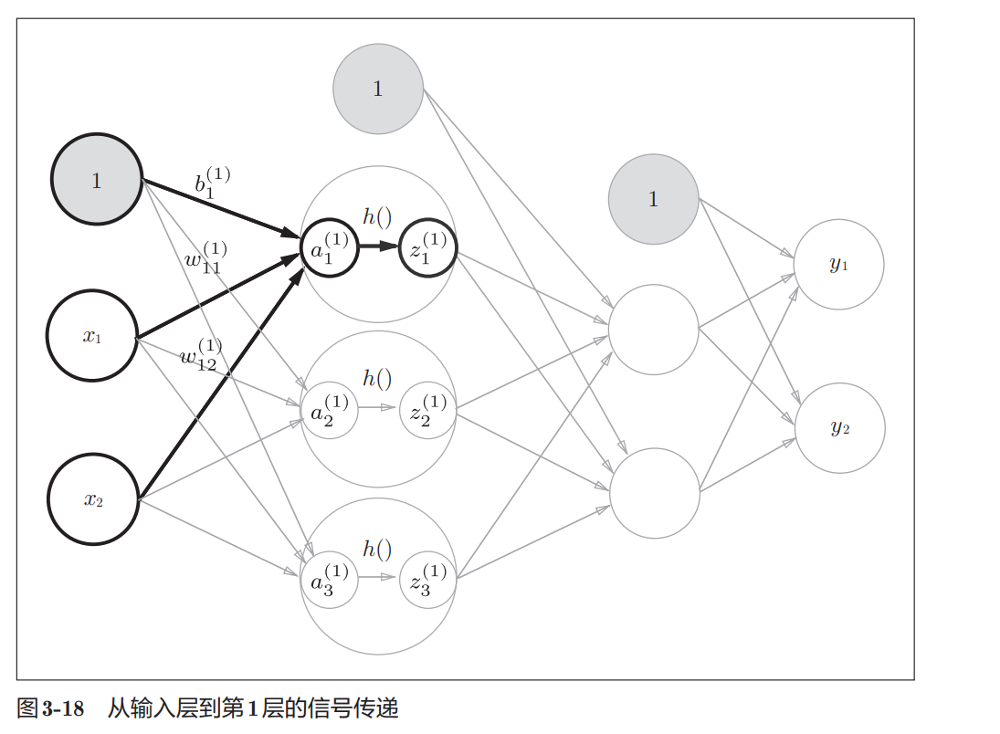

```python
Z1 = sigmoid(A1)
```

- $A$：加权和
- $Z$：激活后输出

------

#### 第1层 → 第2层

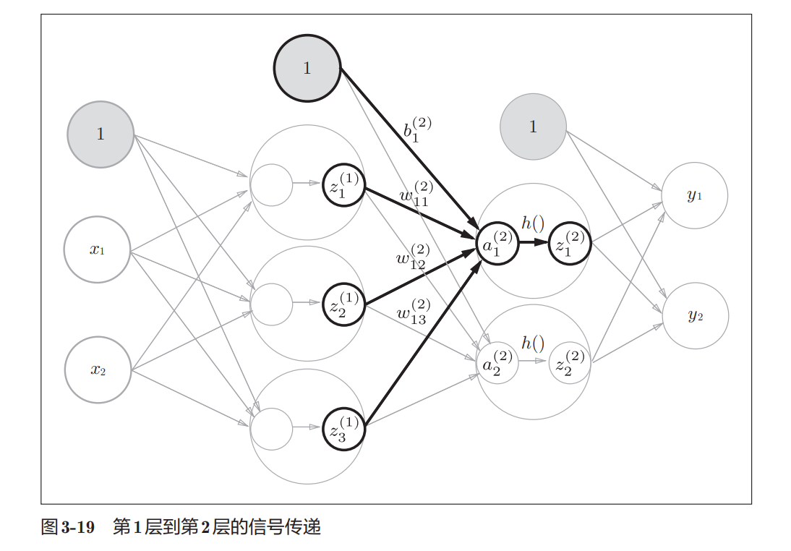

```python
W2 = np.array([
    [0.1, 0.4],
    [0.2, 0.5],
    [0.3, 0.6]
])

B2 = np.array([0.1, 0.2])

A2 = np.dot(Z1, W2) + B2
Z2 = sigmoid(A2)
```

------

#### 第2层 → 输出层

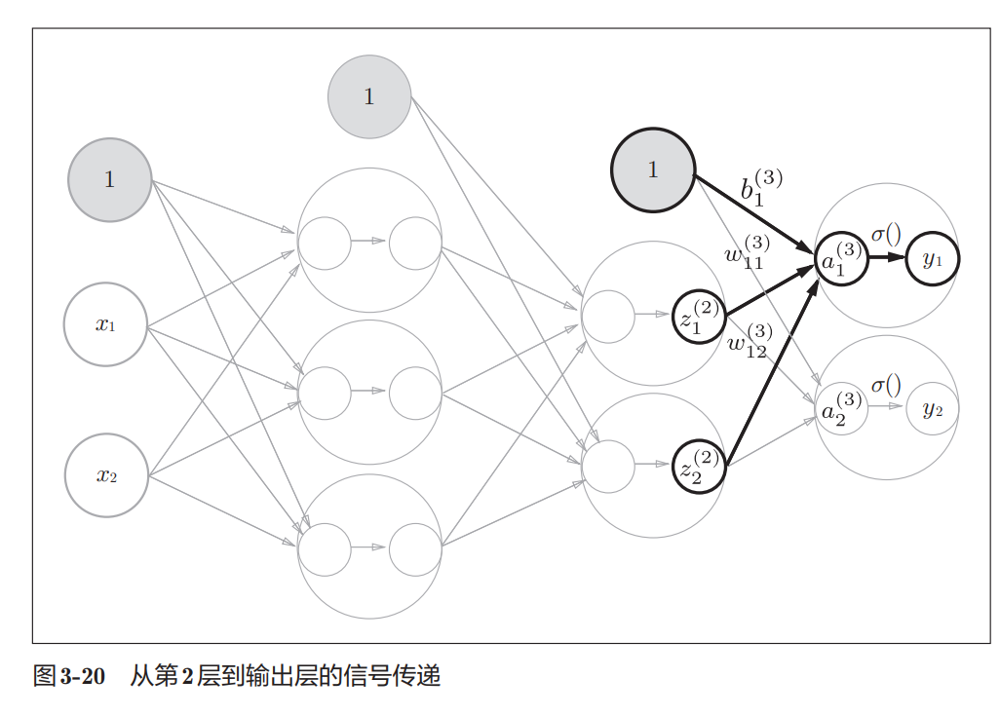

```python
def identity_function(x):
    return x

W3 = np.array([
    [0.1, 0.3],
    [0.2, 0.4]
])

B3 = np.array([0.1, 0.2])

A3 = np.dot(Z2, W3) + B3
Y = identity_function(A3)
```

------

#### 输出层激活函数

- 回归问题：恒等函数
- 二分类：sigmoid
- 多分类：softmax

------

#### 重点

- 神经网络本质：

```
矩阵乘法 + 偏置 + 激活函数
```

- 每层计算流程基本一致：

```python
A = np.dot(X, W) + B
Z = h(A)
```

### 3.4.3 代码实现小结

#### sigmoid函数

```python
def sigmoid(x):
    return 1 / (1 + np.exp(-x))
```

------

#### 恒等函数

```python
def identity_function(x):
    return x
```

------

#### 初始化网络

```python
def init_network():
    network = {}

    network['W1'] = np.array([
        [0.1, 0.3, 0.5],
        [0.2, 0.4, 0.6]
    ])

    network['b1'] = np.array([0.1, 0.2, 0.3])

    network['W2'] = np.array([
        [0.1, 0.4],
        [0.2, 0.5],
        [0.3, 0.6]
    ])

    network['b2'] = np.array([0.1, 0.2])

    network['W3'] = np.array([
        [0.1, 0.3],
        [0.2, 0.4]
    ])

    network['b3'] = np.array([0.1, 0.2])

    return network
```

------

#### 前向传播

```python
def forward(network, x):
    W1, W2, W3 = network['W1'], network['W2'], network['W3']
    b1, b2, b3 = network['b1'], network['b2'], network['b3']

    a1 = np.dot(x, W1) + b1
    z1 = sigmoid(a1)

    a2 = np.dot(z1, W2) + b2
    z2 = sigmoid(a2)

    a3 = np.dot(z2, W3) + b3
    y = identity_function(a3)

    return y
```

------

#### 运行

```python
network = init_network()

x = np.array([1.0, 0.5])

y = forward(network, x)

print(y)
```

输出：

```python
[0.31682708 0.69627909]
```

------

#### 重点

- `init_network()`：初始化参数
- `forward()`：前向传播
- 神经网络核心流程：

```
输入
→ 加权求和
→ 激活函数
→ 输出
```

- 使用 NumPy 可高效实现矩阵化计算

## 3.5 输出层的设计

#### 不同问题使用不同激活函数

- 回归问题：恒等函数
- 分类问题：softmax函数

------

#### 分类问题

预测：

```
属于哪个类别
```

例如：

- 男 / 女
- 猫 / 狗

------

#### 回归问题

预测：

```
连续数值
```

例如：

- 体重
- 房价
- 温度

### 3.5.1 恒等函数和softmax函数

#### 恒等函数

特点：

- 输入直接输出
- 不进行变换

------

#### softmax函数

$$
y_k
=
\frac{\exp(a_k)}
{\sum_{i=1}^{n}\exp(a_i)}
$$

其中：

- 分子：当前输入的指数
- 分母：所有输入指数之和

------

#### softmax特点

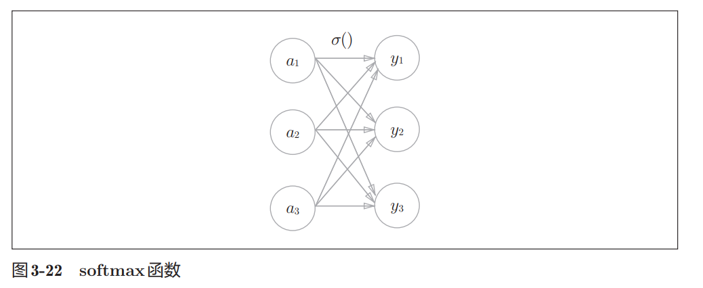

- 所有输出互相关联
- 所有输出值之和为 1
- 常用于分类问题

------

#### NumPy实现

```python
>>> a = np.array([0.3, 2.9, 4.0])

>>> exp_a = np.exp(a)

>>> exp_a
array([ 1.34985881, 18.17414537, 54.59815003])

>>> np.sum(exp_a)
74.1221542101633

>>> y = exp_a / np.sum(exp_a)

>>> y
array([0.01821127, 0.24519181, 0.73659691])
```

------

#### softmax函数实现

```python
def softmax(a):
    exp_a = np.exp(a)
    sum_exp_a = np.sum(exp_a)
    y = exp_a / sum_exp_a

    return y
```

------

#### 重点

- 恒等函数：直接输出
- softmax：转换为概率形式
- 分类问题常使用 softmax 输出层

### 3.5.2 实现 softmax函数时的注意事项

#### 溢出问题

softmax 中包含指数运算：
$$
\exp(x)
$$
当输入很大时：

```python
e^1000 → inf // inf是无穷大的意思
```

会导致：

- overflow（溢出）
- nan（无效结果）

------

#### 改进方法

softmax 可同时减去同一个常数：
$$
y_k
=
\frac{\exp(a_k+C')}
{\sum_{i=1}^{n}\exp(a_i+C')}
$$
通常：

```python
C' = 输入中的最大值
```

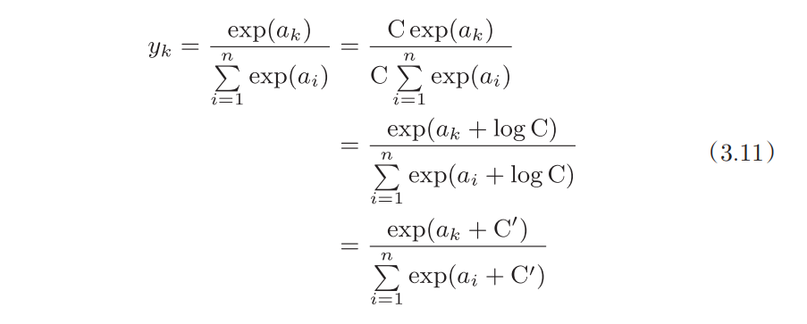

------

#### 示例

```python
>>> a = np.array([1010, 1000, 990])

>>> np.exp(a)
array([inf, inf, inf])
```

会溢出。

------

#### 减去最大值

```python
>>> c = np.max(a)

>>> a - c
array([0, -10, -20])
>>> np.exp(a - c) / np.sum(np.exp(a - c))

array([
9.99954600e-01,
4.53978686e-05,
2.06106005e-09
])
```

------

#### 改进版softmax

```python
def softmax(a):
    c = np.max(a)

    exp_a = np.exp(a - c)

    sum_exp_a = np.sum(exp_a)

    y = exp_a / sum_exp_a

    return y
```

------

#### 重点

- softmax 容易发生指数溢出
- 常用技巧：

**先减去最大值**

- 不会改变最终结果
- 输出结果总和仍为 1

### 3.5.3 softmax函数的特征

#### softmax输出

```python
>>> a = np.array([0.3, 2.9, 4.0])

>>> y = softmax(a)

>>> y
array([
0.01821127,
0.24519181,
0.73659691
])

>>> np.sum(y)
1.0
```

------

#### 特点

- 输出范围：$(0,1)$
- 输出总和为 1
- 可解释为概率

例如：

```
第2类概率最大
```

------

#### 大小关系不变

softmax 前后：

```
最大值位置不会改变
```

因为：

```
exp(x) 单调递增
```

------

#### 分类时的处理

分类问题通常：

```
取输出最大的类别
```

因此：

```
推理阶段常省略 softmax
```

因为不会影响最终分类结果。

------

#### 学习与推理

- 学习（training）：训练模型
- 推理（inference）：使用模型预测

softmax 主要与：

```
训练过程
```

有关。

### 3.5.4 输出层的神经元数量

#### 输出层神经元数量

规则：

```
输出层神经元数量
=
类别数量
```

------

#### 例子：数字识别

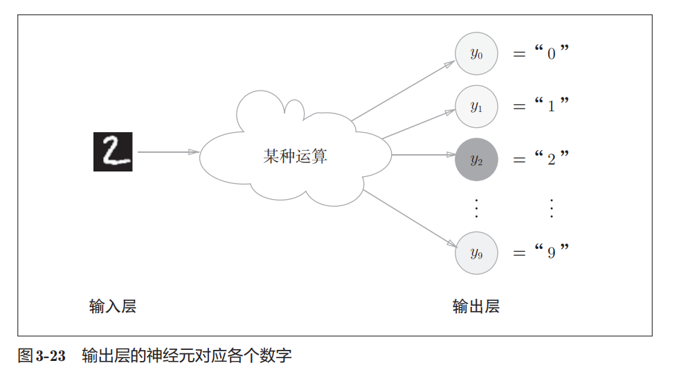

数字分类：

```
0 ~ 9
```

因此：

```
输出层需要10个神经元
```

------

#### 输出含义

```
y0 → 数字0
y1 → 数字1
...
y9 → 数字9
```

------

#### 分类结果

通常：

```
输出值最大的神经元
=
预测类别
```

图中：

```
y2 最大 → 预测结果为 2
```

## 3.6 手写数字识别

这一节开始正式用神经网络解决实际问题：手写数字分类。

流程分为两步：

- 学习（训练）：用训练数据学习权重参数
- 推理（预测）：使用学习好的参数进行分类

本节重点是：

```
神经网络前向传播（forward propagation）
```

即：

```
输入图像
→ 神经网络计算
→ 输出预测结果
```

### 3.6.1 MNIST数据集

MNIST 是机器学习中最经典的手写数字数据集之一，包含：

- 训练集：60000 张图片
- 测试集：10000 张图片

每张图片：

- 表示数字 0～9
- 大小为 `28 × 28`
- 灰度图（单通道）
- 像素值范围：`0 ~ 255`

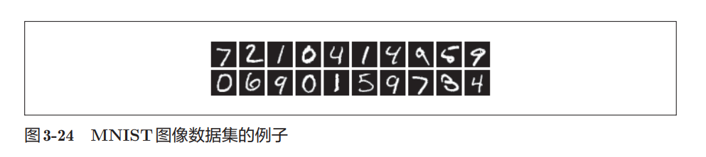

------

#### 读取 MNIST 数据

```python
from mnist import load_mnist

(x_train, t_train), (x_test, t_test) = \
    load_mnist(flatten=True, normalize=False)
```

数据形状：

```python
x_train.shape -> (60000, 784)
t_train.shape -> (60000,)
x_test.shape  -> (10000, 784)
t_test.shape  -> (10000,)
```

在 MNIST 里：

```python
(x_train, t_train), (x_test, t_test)
```

含义是：

| 变量      | 含义         |
| --------- | ------------ |
| `x_train` | 训练图片数据 |
| `t_train` | 训练标签     |
| `x_test`  | 测试图片数据 |
| `t_test`  | 测试标签     |

------

#### load_mnist 参数

```python
load_mnist(
    normalize=True,
    flatten=True,
    one_hot_label=False
)
```

##### normalize

是否归一化：

- `True`：像素缩放到 `0.0 ~ 1.0`
- `False`：保持 `0 ~ 255`

------

##### flatten

是否展开图片：

- `True`

```python
(784,)
```

把 `28×28` 展平成一维数组。

- `False`

```python
(1, 28, 28)
```

保留原始图像结构。

------

##### one_hot_label

是否使用 one-hot 编码：

```python
5 -> [0,0,0,0,0,1,0,0,0,0]
```

只有正确类别为 1，其余为 0。

------

#### 显示 MNIST 图片

```python
img = x_train[0]
label = t_train[0]

print(label) # 5
print(img.shape) # (784,)
```

由于图片被展开成了一维数组：

```python
img = img.reshape(28, 28)
```

恢复成原始二维图像。

------

#### reshape 的作用

```python
(784,) -> (28,28)
```

只是改变数组形状：

- 数据不变
- 排列方式不变

方便图像显示。

------

#### 图像显示

```python
from PIL import Image

pil_img = Image.fromarray(np.uint8(img))
pil_img.show()
```


这里：

- `Image.fromarray()`
   将 NumPy 数组转成图片对象
- `np.uint8()`
   转成图像常用的 8 位整数类型

------

#### 重点

- MNIST 是经典手写数字数据集
- 每张图是 `28×28` 灰度图
- 神经网络输入时常展开成 `(784,)`
- `reshape()` 可恢复图像形状
- `normalize` 控制是否归一化
- `one_hot_label` 控制标签编码方式

### 3.6.2 神经网络的推理处理

这里开始正式使用已经学习好的神经网络进行“推理”。

这个网络：

- 输入层：784 个神经元
   （因为图片大小是 `28×28`）
- 输出层：10 个神经元
   （对应数字 `0~9`）
- 隐藏层：
  - 第1层：50 个神经元
  - 第2层：100 个神经元

------

#### 获取数据

```python
def get_data():
    (x_train, t_train), (x_test, t_test) = \
        load_mnist(
            normalize=True,
            flatten=True,
            one_hot_label=False
        )

    return x_test, t_test
```

这里：

- `normalize=True`

  把像素值从：

```python
0 ~ 255
```

变成：

```python
0.0 ~ 1.0
```

方便神经网络计算。

------

#### 读取已经学习好的参数

```python
def init_network():
    with open("sample_weight.pkl", 'rb') as f:
        network = pickle.load(f)

    return network
```

这里：

```python
sample_weight.pkl
```

保存的是：

- 权重 `W`
- 偏置 `b`

也就是神经网络已经学习完成后的参数。

------

#### 前向传播（推理）

```python
def predict(network, x):
```

核心流程：

```python
输入
→ 第1层
→ sigmoid
→ 第2层
→ sigmoid
→ 输出层
→ softmax
```

代码：

```python
a1 = np.dot(x, W1) + b1
z1 = sigmoid(a1)

a2 = np.dot(z1, W2) + b2
z2 = sigmoid(a2)

a3 = np.dot(z2, W3) + b3
y = softmax(a3)
```

最终：

```python
y
```

是：

```python
[0.01, 0.03, 0.90, ...]
```

这种“每个数字对应的概率”。

------

#### 取得预测结果

```python
p = np.argmax(y)
```

`argmax()`：

- 返回最大值的位置
- 即概率最高的类别

例如：

```python
[0.01, 0.03, 0.90, ...]
```

最大值在索引 `2`：

```python
p = 2
```

表示网络认为这张图是数字 `2`。

------

#### 计算识别精度

```python
if p == t[i]:
    accuracy_cnt += 1
```

如果预测结果：

```python
p
```

和正确标签：

```python
t[i]
```

相同：

则说明分类正确。

最后：

```python
accuracy = 正确数量 / 总数量
```

结果：

```python
Accuracy: 0.9352
```

表示：

```python
93.52%
```

的图片被正确识别。

------

#### normalize 的意义

正规化（normalization）：

```python
像素值 / 255
```

作用：

- 缩小数据范围
- 让数据更稳定
- 提高学习和推理效果

属于一种：

```python
预处理（pre-processing）
```

------

#### whitening（白化）

白化是一种更高级的预处理。

目标：

- 调整数据分布
- 降低数据间相关性
- 让数据更均匀

后面深度学习中会经常见到类似思想。

### 3.6.3 批处理

之前的推理过程：

```python
一次只处理 1 张图片
```

输入：

```python
(784,)
```

输出：

```python
(10,)
```

对应：

- 784 个像素输入
- 10 个类别概率输出

------

#### 网络各层 shape

```python
x[0].shape
# (784,)

W1.shape
# (784, 50)

W2.shape
# (50, 100)

W3.shape
# (100, 10)
```

整体过程：

```python
(784,)
→
(784,50)
→
(50,100)
→
(100,10)
→
(10,)
```

即：

```python
784 → 50 → 100 → 10
```

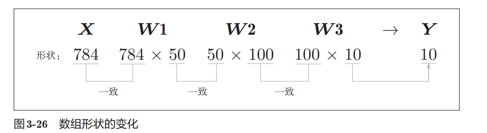

------

#### 批处理（Batch）

如果一次输入：

```python
100 张图片
```

则：

```python
x.shape
# (100, 784)
```

表示：

- 100 条数据
- 每条数据 784 个像素

此时：

```python
(100,784)
·
(784,50)
=
(100,50)
```

后面同理：

```python
(100,50)
·
(50,100)
=
(100,100)

(100,100)
·
(100,10)
=
(100,10)
```

最终：

```python
y.shape
# (100, 10)
```

表示：

```python
100 张图片
对应
100 组分类结果
```

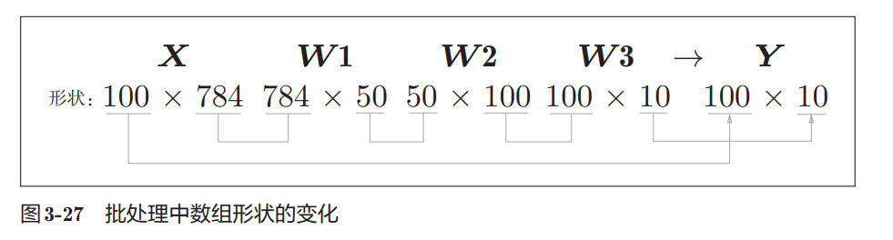

------

#### batch 的意义

batch：

```python
一批数据
```

比如：

```python
100 张图片打包一起算
```

这样：

- 更快
- 更适合矩阵运算
- GPU/NumPy 优化效果更好

------

#### 批处理代码

```python
batch_size = 100
```

表示：

```python
每次处理 100 张图
```

循环：

```python
for i in range(0, len(x), batch_size):
```

等价于：

```python
0
100
200
300
...
```

------

#### 提取 batch

```python
x_batch = x[i:i+batch_size]
```

例如：

```python
x[0:100]
x[100:200]
x[200:300]
```

每次拿 100 张图。

------

#### axis=1

```python
p = np.argmax(y_batch, axis=1)
```

假设：

```python
y_batch.shape
# (100,10)
```

即：

```python
100 行
每行 10 个类别概率
```

`axis=1` 表示：

```python
按行找最大值
```

例如：

```python
[
 [0.1, 0.8, 0.1],
 [0.3, 0.1, 0.6]
]
```

结果：

```python
[1, 2]
```

表示：

- 第1行最大值在索引1
- 第2行最大值在索引2

------

#### 统计正确数量

```python
p == t[i:i+batch_size]
```

得到：

```python
[True, False, True, ...]
```

然后：

```python
np.sum(...)
```

会把：

```python
True -> 1
False -> 0
```

最终得到：

```python
这一批预测正确的数量
```

------

#### 重点

- batch = 一次处理多张图片
- 批处理本质是大型矩阵运算
- shape 必须对应一致
- `axis=1` 表示按行取最大值
- 批处理比逐张处理更高效

## 3.7 小结

本章主要介绍了神经网络的前向传播过程。

神经网络和感知机本质上都属于“信号按层传递”的结构，但两者最大的区别在于激活函数。感知机使用的是阶跃函数，而神经网络通常使用 sigmoid、ReLU 等平滑的非线性函数。正是这种平滑性，使神经网络能够进行有效学习。

同时，本章还学习了如何利用 NumPy 的矩阵运算高效实现神经网络，包括：

- 使用矩阵乘法完成层与层之间的信号传递
- 使用 batch（批处理）提升推理效率
- 根据任务类型选择输出层激活函数
  - 回归问题：恒等函数
  - 分类问题：softmax函数

此外，还通过 MNIST 手写数字数据集实现了一个完整的三层神经网络推理流程，对神经网络的整体结构有了初步认识。
