# 第03章：神经网络

感知机虽然具备表示复杂函数的能力，但存在一个关键问题：

- **权重需要人工设定**
- 面对复杂任务时，手动调整权重几乎不可行

神经网络的目标就是解决这个问题：

> **通过数据自动学习合适的权重参数**

这也是神经网络相比感知机最重要的提升。


## 3.1 从感知机到神经网络

神经网络和上一章介绍的感知机有很多共同点。这里，我们主要以两者 的差异为中心，来介绍神经网络的结构。

### 3.1.1 神经网络的例子

#### 神经网络结构

- **输入层**（Input Layer）
- **隐藏层 / 中间层**（Hidden Layer）
- **输出层**（Output Layer）

 图3-1中，第0层对应输入层，第1层对应中间层，第2层对应输出层。

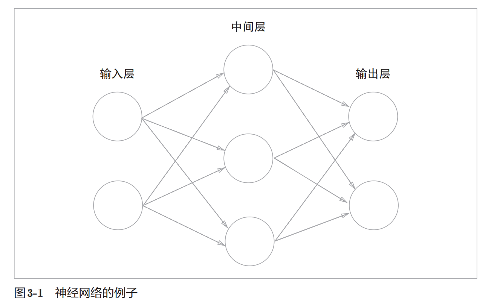

#### 层编号

本书层号从 0 开始：

- 第0层：输入层
- 第1层：隐藏层
- 第2层：输出层

这样编号是为了后续 Python 实现方便。

#### 网络层数

图中共有：

- `3层`神经元
- 只有`2层`带权重的连接

因此本书称其为：

> 2层网络

计算方式：

```
网络层数 = 神经元总层数 - 1
```

### 3.1.2 复习感知机

感知机如图3-2中的网络结构。

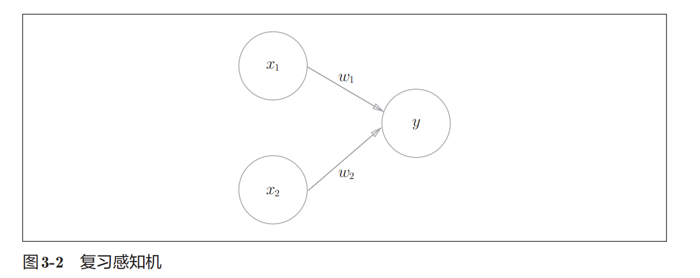


#### 感知机公式

$$
y=
\begin{cases}
0 &(b+w_1x_1+w_2x_2 \le 0) \\
1 &(b+w_1x_1+w_2x_2 > 0)
\end{cases}
$$

---

#### 参数含义

- \($w_1,w_2$\)：权重
- \($b$\)：偏置

---

#### 偏置表示

为了区别于其他神经元，我们在图中把**偏置**神经元整个涂成灰色。

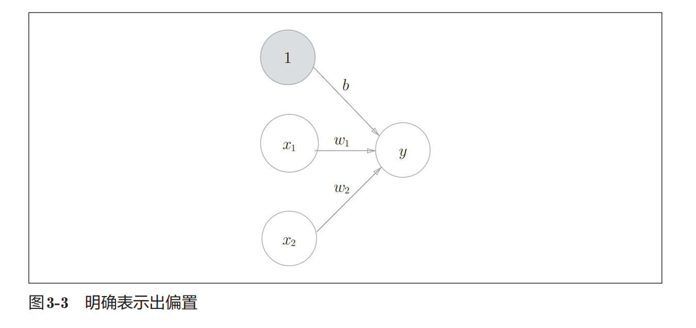

偏置可看作：

- 输入固定为 1
- 权重为 \(b\)

---

#### 函数形式改写

$$
y=h(b+w_1x_1+w_2x_2)
$$

其中：

$$
h(x)=
\begin{cases}
0 &(x \le 0) \\
1 &(x > 0)
\end{cases}
$$

---

#### 重点

- 感知机本质：加权求和后输出结果
- 使用 $h(x)$ 可简化公式表示

### 3.1.3 激活函数登场

#### 激活函数

$h(x)$ 用于将输入信号总和转换为输出。

作用：

- 决定如何激活输入信号总和

#### 分阶段表示

先计算加权总和：
$$
a=b+w_1x_1+w_2x_2
$$
再通过函数转换输出：
$$
y=h(a)
$$

------

#### 计算过程

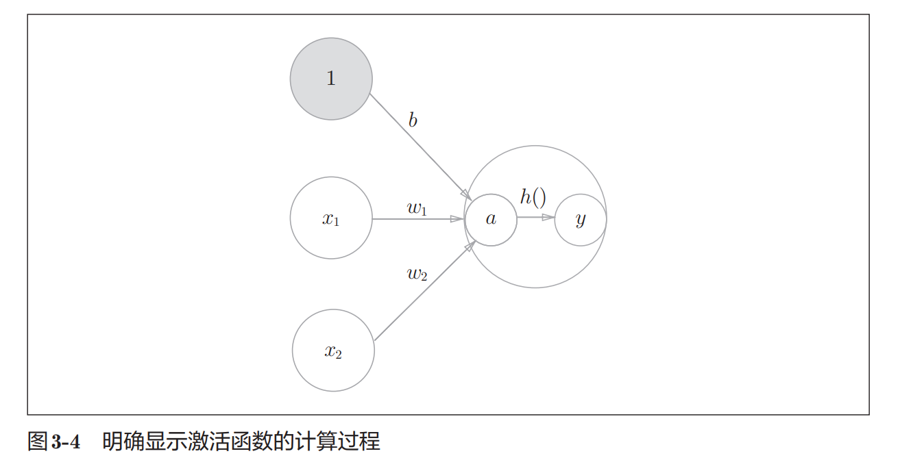

- 节点 $a$：输入信号加权总和
- 节点 $y$：函数转换后的输出

#### 神经元表示

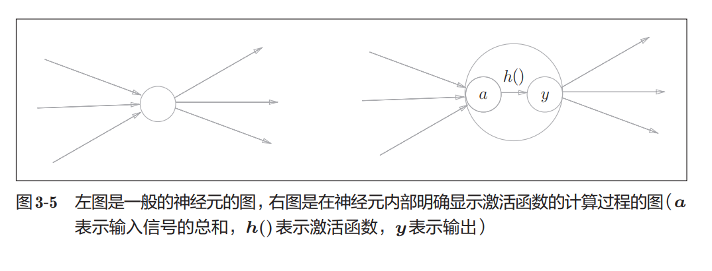

通常：

- 左图：简化表示
- 右图：明确显示函数计算过程

#### 重点

- 激活函数连接感知机与神经网络
- 神经网络本质：加权求和 + 激活函数
- 本书中“节点”与“神经元”含义相同

------

>  补充
>
> - 单层感知机：使用阶跃函数
> - 多层感知机：使用平滑激活函数（如 sigmoid）

## 3.2 激活函数

#### 阶跃函数

阶跃函数：

- 超过阈值输出1
- 否则输出0

感知机使用的就是阶跃函数。

------

#### 神经网络

神经网络与感知机的关键区别：

- 将阶跃函数替换为其他激活函数

之后将介绍神经网络常用激活函数。

### 3.2.1 sigmoid函数

#### sigmoid函数

$$
h(x)=\frac{1}{1+\exp(-x)}
$$

其中：

- $\exp(-x)=e^{-x}$
- $e \approx 2.7182$

------

#### 特点

- 输入一个值
- 输出一个转换后的结果

例如：
$$
h(1.0)=0.731...
$$

------

#### 重点

- 神经网络常使用 sigmoid 函数作为激活函数
- 感知机与神经网络的重要区别：激活函数不同
- 其他结构（多层连接、信号传递）基本相同

### 3.2.2 阶跃函数的实现

#### 阶跃函数

```python
def step_function(x):
    if x > 0:
        return 1
    else:
        return 0
```

缺点：

- 只能处理单个实数
- 不支持 NumPy 数组

------

#### 支持 NumPy 的实现

```python
def step_function(x):
    y = x > 0
    return y.astype(np.int64)
```

------

#### NumPy比较运算

```python
>>> x = np.array([-1.0, 1.0, 2.0])
>>> x > 0

array([False,  True,  True])
```

数组每个元素都会进行比较。

------

#### astype()

```python
>>> y.astype(np.int64)

array([0, 1, 1], dtype=int64)
```

类型转换：

- `True → 1`
- `False → 0`

------

#### 重点

- NumPy 支持数组级运算
- `x > 0` 返回布尔数组
- `astype()` 可进行类型转换

### 3.2.3 阶跃函数的图形

#### 绘制阶跃函数

```python
import numpy as np
import matplotlib.pylab as plt

def step_function(x):
    return np.array(x > 0, dtype=np.int64)

x = np.arange(-5.0, 5.0, 0.1)
y = step_function(x)

plt.plot(x, y)
plt.ylim(-0.1, 1.1)
plt.show()
```

------

#### np.arange()

```python
np.arange(-5.0, 5.0, 0.1)
```

生成：

```python
[-5.0, -4.9, ..., 4.9]
```

------

#### 图像特点

- 以 0 为界
- 输出从 0 切换为 1
- 图像呈阶梯状

因此称为：

> 阶跃函数

对数组x、y进行绘图，结果如图所示。

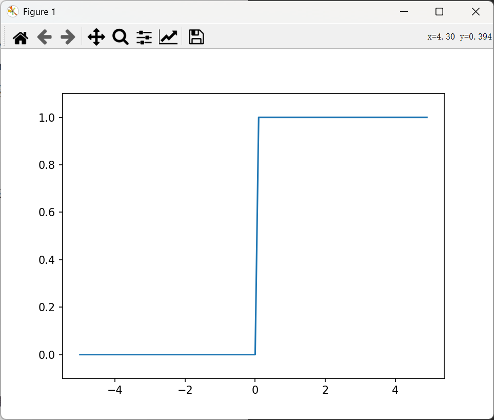

### 3.2.4 sigmoid函数的实现

#### sigmoid函数实现

```
def sigmoid(x):
    return 1 / (1 + np.exp(-x))
```

------

#### 支持 NumPy 数组

```
>>> x = np.array([-1.0, 1.0, 2.0])
>>> sigmoid(x)

array([0.26894142, 0.73105858, 0.88079708])
```

------

#### 广播机制

```
>>> t = np.array([1.0, 2.0, 3.0])

>>> 1.0 + t
array([2., 3., 4.])

>>> 1.0 / t
array([1.        , 0.5       , 0.33333333])
```

标量会自动与数组各元素运算。

------

#### 绘制 sigmoid 函数

```
import numpy as np
import matplotlib.pylab as plt

def sigmoid(x):
    return 1 / (1 + np.exp(-x))

x = np.arange(-5.0, 5.0, 0.1)
y = sigmoid(x)

plt.plot(x, y)
plt.ylim(-0.1, 1.1)
plt.show()
```

------

#### sigmoid函数图像

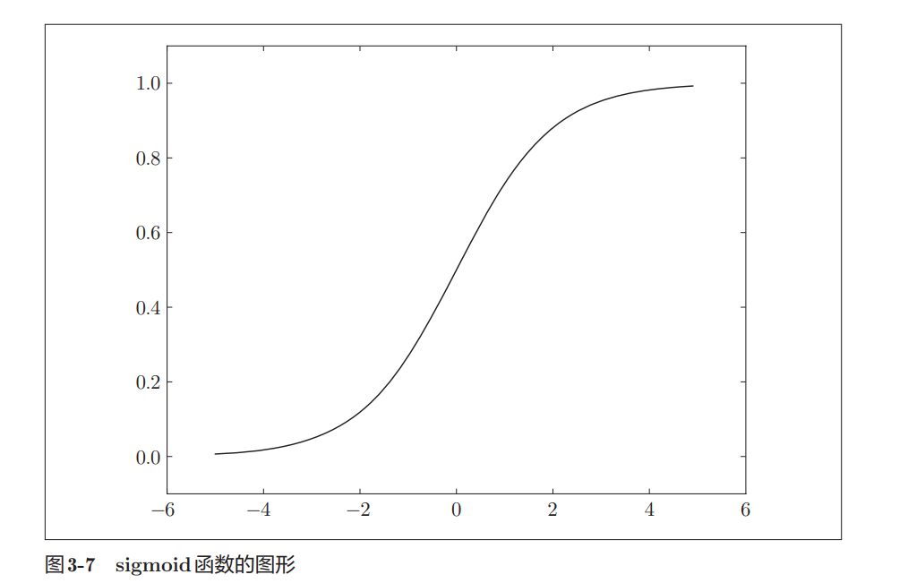

#### 图像特点

- 曲线平滑
- 输出范围：(0, 1)
- 输入越大，越接近 1
- 输入越小，越接近 0

### 3.2.5 sigmoid函数和阶跃函数的比较

#### 对比图

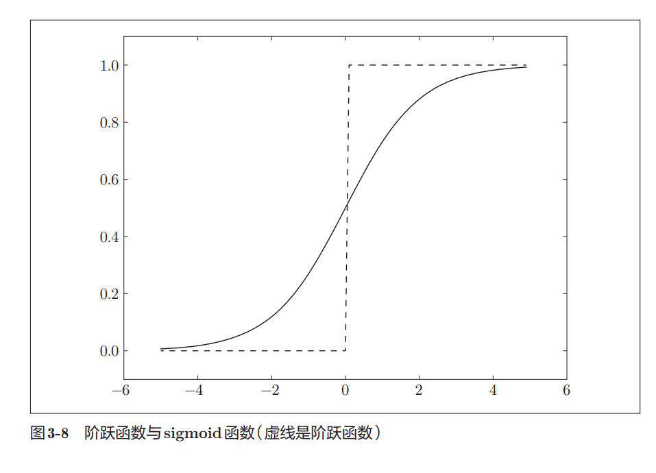

#### 不同点

##### 阶跃函数

- 输出只有 0 或 1
- 变化不连续

##### sigmoid函数

- 输出为连续实数
- 曲线平滑

------

#### 共同点

- 输入小时，输出接近 0
- 输入大时，输出接近 1
- 输出范围都在 $(0,1)$ 之间

------

#### 重点

- 神经网络更常使用平滑的 sigmoid 函数
- sigmoid 的平滑性对神经网络学习很重要

### 3.2.6 非线性函数

#### 非线性函数

- 阶跃函数：阶梯状
- sigmoid函数：曲线状

两者都属于：

> 非线性函数

------

#### 线性函数

线性函数：
$$
h(x)=cx
$$
特点：

- 图像是一条直线

------

#### 为什么不能使用线性函数

若使用线性函数：
$$
h(x)=cx
$$
三层网络：
$$
y(x)=h(h(h(x)))
$$
实际仍可化简为：
$$
y(x)=ax
$$
其中：
$$
a=c^3
$$

------

#### 重点

- 使用线性函数时，多层网络等价于单层网络
- 无法发挥“增加层数”的意义
- 神经网络必须使用非线性函数

### 3.2.7 ReLU函数

#### ReLU函数

$$
h(x)=
\begin{cases}
x &(x>0) \\
0 &(x\le0)
\end{cases}
$$

------

#### 图像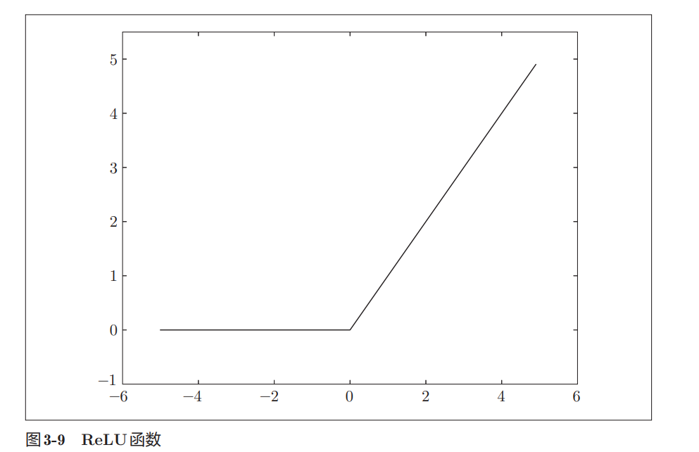

#### 特点

- 输入大于 0：直接输出
- 输入小于等于 0：输出 0

------

#### 实现

```python
def relu(x):
    return np.maximum(0, x)
```

------

#### np.maximum()

```python
np.maximum(a, b)
```

返回两个值中较大的值。

------

#### 重点

- ReLU 是目前常用激活函数
- 结构简单
- 后续章节会大量使用 ReLU 函数

## 3.3 多维数组的运算

如果掌握了NumPy多维数组的运算，就可以高效地实现神经网络。因此，本节将介绍NumPy多维数组的运算，然后再进行神经网络的实现。

### 3.3.1 多维数组

#### 一维数组

```python
>>> A = np.array([1, 2, 3, 4])

>>> np.ndim(A)
1

>>> A.shape
(4,)

>>> A.shape[0]
4
```

- `np.ndim()`：查看维数
- `shape`：查看数组形状

------

#### 二维数组

```python
>>> B = np.array([
... [1, 2],
... [3, 4],
... [5, 6]
... ])

>>> np.ndim(B)
2

>>> B.shape
(3, 2)
```

表示：

- 3 行
- 2 列

#### 行与列


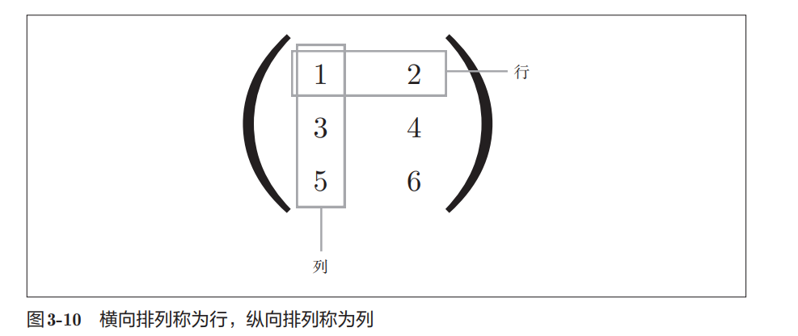

- 横向：行（row）
- 纵向：列（column）

------

#### 重点

- 多维数组是数字的集合
- 二维数组也称为矩阵（matrix）
- `shape` 返回结果为元组（tuple）

### 3.3.2 矩阵乘法

#### 矩阵乘法

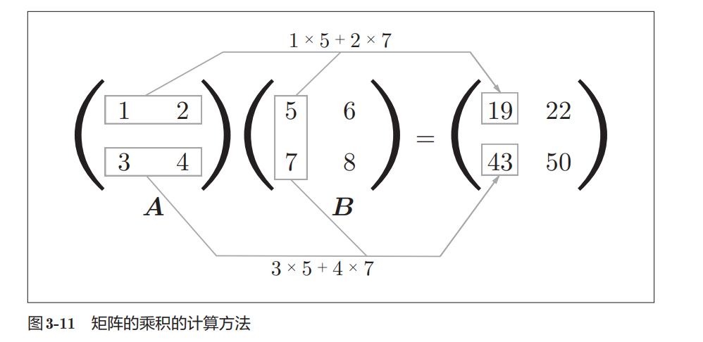

计算规则：

- 左矩阵的“行”
- 乘右矩阵的“列”
- 对应元素相乘后求和

------

#### NumPy实现

```python
>>> A = np.array([[1, 2], [3, 4]])
>>> B = np.array([[5, 6], [7, 8]])

>>> np.dot(A, B)

array([[19, 22],
       [43, 50]])
```

---

#### 可拆分理解（我倾向的理解方式）

矩阵乘法可理解为：
$$
\begin{bmatrix}
1 & 2 \\
3 & 4
\end{bmatrix}
\begin{bmatrix}
5 & 6 \\
7 & 8
\end{bmatrix}
=
\begin{bmatrix}
1 \\
3
\end{bmatrix}
[5\ 6]
+
\begin{bmatrix}
2 \\
4
\end{bmatrix}
[7\ 8]
$$
即：

- 左矩阵按**列**拆
- 右矩阵按**行**拆
- 多个外积相加

这种理解在线性代数和深度学习里非常常见。

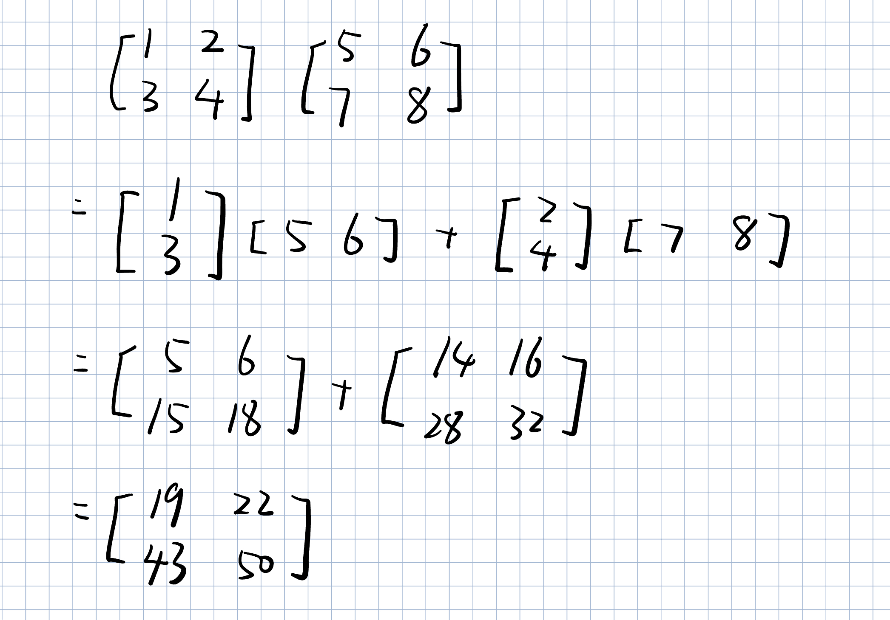

#### shape规则

矩阵乘法要求：

```python
左矩阵列数 == 右矩阵行数
```

例如：

```python
(3×2) · (2×4) → (3×4)
```

结果shape：

```python
结果行数来自左矩阵
结果列数来自右矩阵
```

------

#### 一维数组情况

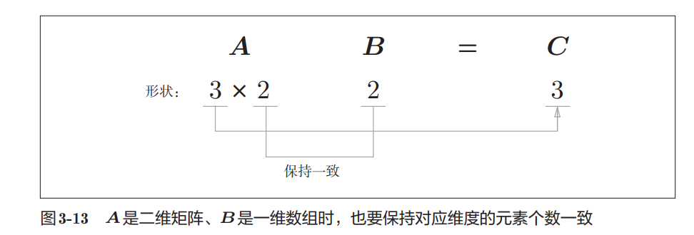

```python
>>> A.shape
(3, 2)

>>> B.shape
(2,)
>>> np.dot(A, B)

array([23, 53, 83])
```

------

#### 一维数组本质

- `(2,)` 本质是一维数组
- 不是严格行向量/列向量

真正列向量：

```python
[[7],
 [8]]
```

shape：

```python
(2,1)
```

真正行向量：

```python
[[7,8]]
```

shape：

```python
(1,2)
```

### 3.3.3 神经网络的内积

#### 神经网络矩阵表示

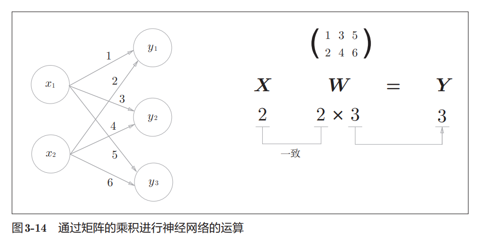

- 输入：$X$
- 权重：$W$
- 输出：$Y$

------

#### shape

```python
X : (2,)
W : (2,3)
Y : (3,)
```

矩阵乘法要求：

```python
X 的元素个数
=
W 的行数
```

------

#### NumPy实现

```python
>>> X = np.array([1, 2])

>>> W = np.array([
... [1, 3, 5],
... [2, 4, 6]
... ])

>>> np.dot(X, W)

array([ 5, 11, 17])
```

------

#### 计算结果

$$
Y=
[
1\times1+2\times2,\ 
1\times3+2\times4,\ 
1\times5+2\times6
]
$$

------

#### 重点

- 神经网络计算本质是矩阵乘法
- `np.dot()` 可一次性完成多个节点计算
- 比逐个 `for` 计算效率更高

