# 第04章：神经网络的学习

本章开始进入神经网络最核心的内容之一——**学习**。

这里的“学习”，指的是：

- 利用训练数据
- 自动调整权重参数
- 让神经网络的预测越来越准确

在前面的章节中，我们一直是在“使用”已经设定好的权重进行前向传播，而这一章开始，我们要研究：

```
如何让神经网络自己找到这些权重
```

为了衡量神经网络预测得好不好，本章会引入：

- 损失函数（Loss Function）
- 梯度（Gradient）
- 梯度下降法（Gradient Descent）

神经网络学习的目标，本质上就是：

```
找到能让损失函数最小的参数
```

而梯度法，则是寻找这个最优参数的重要方法。

------

## 4.1 从数据中学习

神经网络最大的特点之一，就是：

```
参数可以通过数据自动学习
```

这和之前感知机中“手动设置权重”完全不同。

在第2章里：

- AND
- OR
- NAND

这些逻辑门的参数，都是我们根据真值表人工设计的。

但现实中的神经网络：

- 参数数量可能有几十万
- 甚至上亿

例如：

```
W1.shape = (784, 100)
W2.shape = (100, 200)
W3.shape = (200, 10)
```

仅仅几个矩阵，就已经包含大量参数。

因此：

```
人工调参数是不现实的
```

所以必须让神经网络：

```
根据训练数据自动优化参数
```

这就是“学习”。

------

本章后面会使用：

```
MNIST 手写数字数据集
```

真正实现：

- 参数学习
- 损失计算
- 梯度更新

从而让神经网络逐渐学会识别数字。

------

补充：

第2章的感知机其实也可以“学习”。

根据：

```
感知机收敛定理
```

对于：

```
线性可分问题
```

感知机可以通过有限次学习找到正确参数。

但是：

```
非线性可分问题
```

例如 XOR：

```
单层感知机无法自动学习解决
```

而神经网络：

- 通过多层结构
- 非线性激活函数

能够学习更加复杂的问题。

### 4.1.1 数据驱动

机器学习最核心的东西其实就是：

```
数据
```

没有数据，机器学习几乎什么都做不了。

传统编程里，人通常会自己设计规则：

- 遇到什么情况怎么办
- 哪些特征重要
- 应该如何判断

本质上是：

```
人写规则 → 程序执行规则
```

但机器学习反过来了：

```
给机器大量数据 → 机器自己找规律
```

这就是“数据驱动”。

------

书里举了一个经典例子：

```
识别手写数字 5
```

看起来很简单，因为人一眼就能认出来。

但如果真让我们写程序：

```
到底怎样才算“5”？
```

其实非常难描述。

因为不同人的写法差异特别大：

- 有人写得圆
- 有人写得瘦
- 有人连笔
- 有人倾斜

图4-1里就能明显看出来：

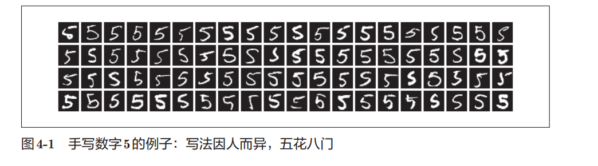

```
同样都是 5，但长得五花八门
```

所以：

```
人能直觉识别
≠
人能准确总结规则
```

这也是传统人工规则方法的困难所在。

------

早期机器学习的一种典型思路是：

```
先人工提取“特征”
再让机器学习这些特征
```

例如图像处理中，人们会设计：

- SIFT
- SURF
- HOG

这些“特征量”。

本质上是：

```
人先告诉机器：
“图像里什么信息重要”
```

然后再交给：

- SVM
- KNN

等算法分类。

也就是说：

```
机器负责学习
但“看什么”仍然由人决定
```

------

而神经网络（深度学习）最大的不同在于：

```
连特征也自己学习
```

它直接输入原始图像：

```
像素 → 神经网络 → 输出结果
```

中间不需要人工设计特征。

所以图4-2里：

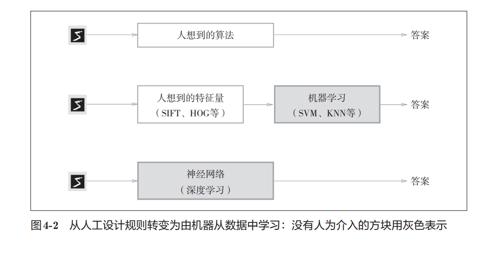

- 灰色部分表示“机器自动完成”
- 神经网络那一行几乎全部是灰色

意味着：

```
人为干预更少
```

------

传统方法：

```
图像
→ 人工特征
→ 机器学习
→ 结果
```

深度学习：

```
图像
→ 神经网络自动学习
→ 结果
```

这也是：

```
端到端（End-to-End）
```

学习的含义。

所谓“端到端”：

```
从原始输入
直接得到最终输出
```

中间不需要人为拆步骤。

------

神经网络还有一个很大的优势：

```
同一套流程
可以解决很多不同问题
```

比如：

- 识别数字
- 识别猫狗
- 人脸识别
- 语音识别

传统方法往往都要：

```
重新设计特征
```

但神经网络通常只需要：

```
换数据继续训练
```

即可。

### 4.1.2 训练数据和测试数据

在机器学习中，数据通常不会直接全部拿来训练，而是会分成两部分：

- 训练数据（Training Data）
- 测试数据（Test Data）

其中：

- 训练数据用于让模型学习规律、调整参数
- 测试数据用于检验模型真正的效果

这样做的核心目的，是为了验证模型有没有“泛化能力”。

这里的“泛化能力”，可以理解成：

> 模型是否能处理从来没见过的新数据。

机器学习真正追求的，并不是“把训练集背下来”，而是能够举一反三。

比如手写数字识别：

训练时，模型可能看过很多人的数字“8”。

但实际应用时，系统面对的是：

- 没见过的人
- 没见过的字迹
- 不同风格的数字

如果模型依然能正确识别，就说明它具备较好的泛化能力。

否则，就可能只是死记硬背了训练数据里的写法。

------

因此，只使用同一批数据来：

- 训练模型
- 再评价模型

其实是不可靠的。

因为模型很可能只是“记住了答案”。

这种现象叫作：

```
过拟合（Overfitting）
```

也就是：

> 模型在训练数据上表现很好，但面对新数据时效果很差。

避免过拟合，是机器学习中的一个重要问题。

## 4.2 损失函数

在神经网络学习过程中，模型需要一个“标准”来判断自己当前表现得怎么样。

这个标准，就是：

```
损失函数（Loss Function）
```

可以把它理解成：

> 神经网络当前“犯错的程度”。

损失函数会用一个数值来表示模型预测结果和真实答案之间的差距。

- 差距越大
   → 损失越大
- 差距越小
   → 损失越小

而神经网络训练的目标，其实就是：

> 不断调整参数，让损失函数尽可能变小。

------

书里用了“幸福指数”来举例，其实很好理解。

正常人描述幸福时，可能只会说：

- “还不错”
- “一般般”
- “挺开心”

但如果能给幸福程度打分，比如：

```
幸福指数 = 10.23
```

那就能更精确地比较不同状态。

神经网络也是类似的。

它不会简单地判断：

- “预测得还行”
- “预测得不好”

而是会通过损失函数，把当前错误程度转换成一个具体数值。

这样模型才能知道：

- 现在效果怎么样
- 参数调整后有没有变好
- 应该往哪个方向优化

------

这里有一个容易混淆的点：

损失函数衡量的是“坏的程度”。

也就是说：

- 损失越大
   → 模型越差
- 损失越小
   → 模型越好

因此，训练的目标通常写成：

```
最小化损失函数
```

本质上等价于：

```
最大化模型性能
```

只是数学上更习惯使用“最小化错误”这种表达方式。

------

实际中，损失函数可以自由设计。

但神经网络里最常见的有两种：

- 均方误差（Mean Squared Error）
- 交叉熵误差（Cross Entropy Error）

后面会重点介绍这两种损失函数。

### 4.2.1 均方误差

均方误差（Mean Squared Error，MSE）是最经典的损失函数之一。

它的作用很简单：

> 计算“预测结果”和“真实答案”之间到底差了多少。

公式如下：
$$
E=\frac{1}{2}\sum_{k}(y_k-t_k)^2
$$
其中：

- `y_k`
   表示神经网络的输出
- `t_k`
   表示真实标签（监督数据）
- `k`
   表示第 `k` 个元素

整个公式的流程其实就是：

1. 预测值减去真实值
2. 对误差平方
3. 全部加起来

因为用了平方：

- 误差越大，惩罚越明显
- 正负误差不会互相抵消

前面的 `1/2` 主要是为了后面求导方便，对结果本质影响不大。

------

在手写数字识别中，输出层通常有 10 个神经元，对应数字：

```python
0 ~ 9
```

例如：

```python
y = [0.1, 0.05, 0.6, 0.0, 0.05, 0.1, 0.0, 0.1, 0.0, 0.0]
```

这里表示模型认为：

- 是“0”的概率：0.1
- 是“1”的概率：0.05
- 是“2”的概率：0.6
- ...

其中概率最大的“2”，说明模型最倾向于认为答案是数字 2。

------

而监督数据 `t`：

```python
t = [0, 0, 1, 0, 0, 0, 0, 0, 0, 0]
```

这里正确答案是“2”。

因为只有索引为 2 的位置是 `1`。

这种表示方法叫：

```python
One-Hot 表示
```

特点是：

- 正确标签位置为 `1`
- 其他位置全部为 `0`

------

均方误差的 Python 实现非常直接：

```python
def mean_squared_error(y, t):
    return 0.5 * np.sum((y - t) ** 2)
```

这里：

```python
(y - t) ** 2
```

表示：

- 先计算误差
- 再逐元素平方

然后：

```python
np.sum()
```

把所有误差加起来。

------

书里给了两个例子。

第一个例子：

```python
y = [0.1, 0.05, 0.6, 0.0, 0.05, 0.1, 0.0, 0.1, 0.0, 0.0]
```

模型认为“2”的概率最高。

而正确答案也正好是“2”。

因此损失较小：

```python
0.0975
```

------

第二个例子：

```python
y = [0.1, 0.05, 0.1, 0.0, 0.05, 0.1, 0.0, 0.6, 0.0, 0.0]
```

这里模型最相信的是“7”。

但正确答案其实是“2”。

因此误差明显更大：

```python
0.5975
```

------

也就是说：

> 均方误差越小，说明模型预测越接近真实答案。

神经网络训练的目标，本质上就是：

```python
不断调整参数，让均方误差越来越小
```

### 4.2.2 交叉熵误差

除了均方误差之外，神经网络里还有一个非常常用的损失函数：

```python
交叉熵误差（Cross Entropy Error）
```

它的公式如下：
$$
E=-\sum_k t_k\log y_k
$$
其中：

- `y_k`
   表示模型输出的概率

- `t_k`
   表示正确标签（one-hot）

- `log`
   表示自然对数

  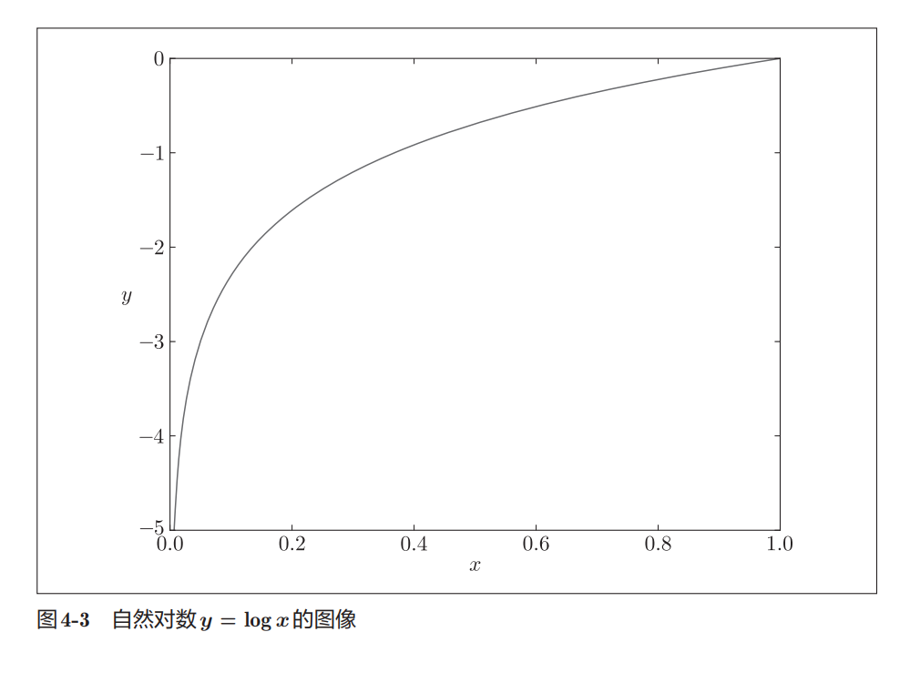

------

交叉熵误差和均方误差最大的不同在于：

> 它只关心“正确答案对应的概率”有多大。

因为在 one-hot 表示中：

```python
t = [0, 0, 1, 0, 0, ...]
```

只有正确标签的位置是 `1`。

其他位置全是 `0`。

所以：

```python
t_k * log(y_k)
```

实际上只有正确答案那一项会被保留下来。

------

比如：

正确答案是数字 `2`。

如果模型输出：

```python
y = [0.1, 0.05, 0.6, ...]
```

那么真正参与计算的，其实只有：

```python
-log(0.6)
```

结果约等于：

```python
0.51
```

------

如果模型对正确答案非常没信心：

```python
y = [0.1, 0.05, 0.1, ..., 0.6, ...]
```

此时正确答案“2”的概率只有：

```python
0.1
```

那么损失会变成：

```python
-log(0.1) ≈ 2.30
```

误差一下子变得很大。

------

这里其实体现了交叉熵误差的核心思想：

- 正确答案概率越大
   → 损失越小
- 正确答案概率越小
   → 损失越大

当模型对正确答案的概率预测为：

```python
1
```

时：

```python
log(1) = 0
```

因此：

```python
交叉熵误差 = 0
```

说明模型预测完全正确。

------

自然对数函数的图像大致如下：

- 当 `x → 1` 时
   → `log(x) → 0`
- 当 `x → 0` 时
   → `log(x)` 会快速减小

因此：

```python
-log(x)
```

会在概率很小时迅速变大。

这意味着：

> 如果模型把正确答案概率预测得很低，交叉熵会给予非常大的惩罚。

这也是它在分类问题中特别好用的原因。

------

交叉熵误差的代码实现如下：

```python
def cross_entropy_error(y, t):
    delta = 1e-7
    return -np.sum(t * np.log(y + delta))
```

这里：

```python
delta = 1e-7
```

是一个非常小的值。

作用是防止：

```python
np.log(0)
```

因为：

```python
log(0) = -∞
```

会导致程序无法正常计算。

因此通常会人为加一个极小值做保护。

------

从结果上也能明显看出来：

- 正确答案概率高
   → 交叉熵小
- 正确答案概率低
   → 交叉熵大

因此，训练神经网络时：

```python
让交叉熵误差不断减小
```

就等价于：

```python
让模型越来越相信正确答案
```

### 4.2.3 mini-batch学习

前面介绍的均方误差和交叉熵误差，都是针对**单个样本**计算的。

但实际训练神经网络时，我们面对的是整个训练集，因此损失函数也应该反映所有训练数据的整体表现。

以交叉熵误差为例，当训练集包含 `N` 个样本时，损失函数可以写成：
$$
E=-\frac{1}{N}\sum_n\sum_k t_{nk}\log y_{nk}
$$
这里：

- `N`：训练样本总数
- `n`：第 `n` 个样本
- `k`：输出层第 `k` 个神经元
- $y_{nk}$：模型对第 `n` 个样本的预测结果
- $t_{nk}$：第 `n` 个样本的真实标签

其实这个公式并不复杂，本质上就是：

> 把每个样本的交叉熵误差全部加起来，再求平均值。

最后除以 `N` 的作用是进行平均化（正规化）。

这样无论训练集有：

- 100 条数据
- 1000 条数据
- 10000 条数据

最终得到的损失函数都处于同一个量级，便于比较和分析。

------

不过，实际训练时通常不会每次都使用全部训练数据。

原因很简单：

- 数据量太大
- 计算速度太慢
- 每更新一次参数都要遍历全部样本

例如：

MNIST 训练集有：

```
60000 个样本
```

如果每次计算损失函数都使用全部数据，训练效率会非常低。

而现实中的数据集往往有：

- 几百万条
- 几千万条
- 甚至更多

这种情况下，全量计算几乎是不现实的。

------

因此，深度学习采用了一种折中的方法：

> 每次只随机抽取一小部分数据参与训练。

这部分数据称为：

```
Mini-Batch（小批量）
```

例如：

```python
训练集：60000条

随机抽取：100条
```

然后：

- 计算这100条数据的损失函数
- 计算梯度
- 更新参数

下一次再随机抽取另外100条数据继续训练。

这种训练方式就叫：

```python
Mini-Batch Learning
```

------

以 MNIST 为例：

```python
(x_train, t_train), (x_test, t_test) = \
    load_mnist(normalize=True, one_hot_label=True)
```

读取完成后：

```python
x_train.shape
# (60000, 784)

t_train.shape
# (60000, 10)
```

这里：

- `60000` 表示训练样本数量
- `784` 表示输入层维度（28×28像素）
- `10` 表示输出层维度（数字0~9）

因此：

```python
x_train[i]
```

表示第 `i` 道题（输入图片）

而：

```python
t_train[i]
```

表示对应的标准答案。

两者下标一一对应。

------

接下来随机抽取一个 Mini-Batch：

```python
train_size = x_train.shape[0]
batch_size = 10

batch_mask = np.random.choice(train_size, batch_size)

x_batch = x_train[batch_mask]
t_batch = t_train[batch_mask]
```

这里：

```python
np.random.choice(60000, 10)
```

会随机生成 10 个索引，例如：

```python
array([
    11035, 34071, 37349, 56787, 27918,
     1853, 11821, 31543, 14277, 8427
])
```

然后：

```python
x_train[batch_mask]
```

取出对应的 10 张图片。

```python
t_train[batch_mask]
```

取出对应的 10 个答案。

于是就得到了一个：

```python
Mini-Batch = 10组(图片 + 标签)
```

> 这里的 Mini-Batch 本质上就是随机抽出来的 10 组训练样本。

------

**本节重点**

- 损失函数最终关注的是整个训练集的平均误差。
- 全量数据计算代价太高，因此实际训练采用 Mini-Batch。
- Mini-Batch 就是从训练集中随机抽取的一小部分样本。
- `x_train[i]` 是第 `i` 个输入数据，`t_train[i]` 是对应答案。
- `batch_size=10` 时，每次训练只使用随机选出的 10 组样本。
- 神经网络训练过程本质上是在不断抽取 Mini-Batch，并利用它们更新参数。

### 4.2.4 mini-batch版交叉熵误差的实现

前面实现的交叉熵误差只适用于**单个样本**。

但实际训练时，我们输入的往往是一个 Mini-Batch，因此需要让损失函数能够一次处理多条数据。

------

首先来看支持 Batch 的版本：

```python
def cross_entropy_error(y, t):
    if y.ndim == 1:
        t = t.reshape(1, t.size)
        y = y.reshape(1, y.size)

    batch_size = y.shape[0]

    return -np.sum(t * np.log(y + 1e-7)) / batch_size
```

这里增加了两个关键处理。

------

#### 处理单个样本输入

如果：

```python
y.ndim == 1
```

说明输入的是：

```python
y = [0.1, 0.2, 0.7, 0, 0, 0, 0, 0, 0, 0]
```

这样的单条数据。

而后面的代码统一按照二维数组处理，因此需要先转换形状：

```python
y.reshape(1, y.size)
```

例如：

```python
[0.1, 0.2, 0.7, 0, 0, 0, 0, 0, 0, 0]
```

变成：

```python
[[0.1, 0.2, 0.7, 0, 0, 0, 0, 0, 0, 0]]
```

形状从：

```python
(10,)
```

变成：

```python
(1, 10)
```

这样无论输入一个样本还是多个样本，都能使用同一套代码。

------

#### 求平均损失

```python
batch_size = y.shape[0]
```

表示当前 Batch 中有多少条数据。

例如：

```python
y.shape
# (100, 10)
```

说明：

- Batch 中有100个样本
- 每个样本有10个分类概率

因此：

```python
batch_size = 100
```

最后：

```python
/ batch_size
```

表示求平均损失。

这样得到的结果不会因为 Batch 大小不同而发生明显变化。

------

#### 标签形式的交叉熵误差

前面的写法要求监督数据采用 One-Hot 表示：

```python
t = [0,0,1,0,0,0,0,0,0,0]
```

但很多时候标签其实直接保存为：

```python
t = 2
```

或者：

```python
t = [2,7,0,9,4]
```

此时可以进一步优化：

```python
def cross_entropy_error(y, t):
    if y.ndim == 1:
        t = t.reshape(1, t.size)
        y = y.reshape(1, y.size)

    batch_size = y.shape[0]

    return -np.sum(
        np.log(y[np.arange(batch_size), t] + 1e-7)
    ) / batch_size
```

------

#### 为什么可以这样写？

先回忆 One-Hot 版本：

```python
t * np.log(y)
```

例如：

```python
t = [0,0,1,0]
y = [0.1,0.2,0.6,0.1]
```

计算后：

```python
[0, 0, log(0.6), 0]
```

实际上只有正确答案的位置保留下来了。

其他位置全被乘成了0。

所以我们真正需要的其实只是：

```python
log(0.6)
```

也就是：

> 正确标签对应位置的预测概率。

------

#### np.arange(batch_size) 的作用

假设：

```python
batch_size = 5
```

那么：

```python
np.arange(batch_size)
```

得到：

```python
[0, 1, 2, 3, 4]
```

如果标签为：

```python
t = [2, 7, 0, 9, 4]
```

表示：

- 第0个样本正确答案是2
- 第1个样本正确答案是7
- 第2个样本正确答案是0
- 第3个样本正确答案是9
- 第4个样本正确答案是4

此时：

```python
y[np.arange(batch_size), t]
```

等价于：

```python
[
    y[0,2],
    y[1,7],
    y[2,0],
    y[3,9],
    y[4,4]
]
```

即：

> 一次性取出每个样本对应正确答案的预测概率。

例如：

```python
[0.6, 0.8, 0.9, 0.7, 0.5]
```

然后再计算：

```python
np.log(...)
```

即可得到交叉熵误差。

------

**本节重点**

- Mini-Batch版交叉熵误差需要同时支持单个样本和批量样本。
- `reshape()` 用于把一维数据统一转换成二维数据。
- `batch_size = y.shape[0]` 表示 Batch 中样本数量。
- 最后除以 `batch_size`，得到平均损失。
- 标签形式比 One-Hot 更节省空间。
- `y[np.arange(batch_size), t]` 可以一次性取出每个样本正确类别对应的预测概率。
- 交叉熵误差本质上只关心**正确答案对应的概率有多大**。

### 4.2.5 为何要设定损失函数

学习到这里，一个很自然的问题是：

> 我们最终想提高的是识别准确率，为什么还要额外设计一个损失函数呢？

例如在手写数字识别中：

- 最终目标是提高识别精度
- 训练时却在不断减小损失函数

看起来好像绕了一圈。

实际上，这是因为神经网络学习依赖于**导数（梯度）**。

------

神经网络训练时，会不断调整：

- 权重（Weight）
- 偏置（Bias）

而调整方向则由导数决定。

例如：

```python
某个权重的导数 < 0
```

说明：

> 增大这个权重，损失函数会减小。

反之：

```python
某个权重的导数 > 0
```

说明：

> 减小这个权重，损失函数会减小。

因此，训练过程实际上是在做：

```python
计算梯度 → 更新参数 → 降低损失
```

如果导数为 0：

```python
参数怎么改都不会让损失变化
```

此时学习就停止了。

------

那么为什么不用识别精度来求导呢？

原因在于：

> 识别精度是不连续的。

举个例子。

假设：

```python
100 个样本

正确识别 32 个
```

那么：

```python
Accuracy = 32%
```

此时即使把网络参数稍微调整一点点：

```python
32% → 32%
```

识别精度通常不会发生变化。

因为预测结果还没有跨过分类边界。

------

例如：

原来模型输出：

```python
数字2概率 = 0.51
数字7概率 = 0.49
```

预测结果：

```python
2
```

调整参数后：

```python
数字2概率 = 0.55
数字7概率 = 0.45
```

预测结果仍然是：

```python
2
```

因此：

```python
准确率完全没变
```

虽然模型实际上已经变好了。

------

识别精度的变化往往是这样的：

```python
32%
32%
32%
32%
33%
33%
33%
```

它只能跳跃式变化。

而不会出现：

```python
32.0001%
32.0002%
32.0003%
```

这样的连续变化。

因此：

> 准确率对于微小参数变化几乎没有反应。

对应的导数自然大部分时候都是：

```python
0
```

这样梯度下降法就失去了作用。

------

而损失函数不同。

例如交叉熵误差：

```python
0.92543
```

参数稍微变化一点：

```python
0.92317
```

再变化一点：

```python
0.92084
```

损失会连续变化。

这样就能计算导数。

也就能知道：

```python
参数应该往哪个方向调整
```

------

这也是为什么神经网络训练时：

```python
优化目标 = 损失函数
```

而不是：

```python
优化目标 = 识别精度
```

实际上：

- 训练阶段优化损失函数
- 评估阶段观察识别精度

两者分工不同。

------

这个问题和第3章提到的激活函数其实非常类似。

阶跃函数：

```python
x < 0 → 0

x ≥ 0 → 1
```

图像像开关一样。

除了跳变点以外：

```python
导数 = 0
```

$$
y=\begin{cases}0&(x<0)\\1&(x\ge0)\end{cases}
$$

因此参数即使发生微小变化：

```python
输出也不会变化
```

神经网络就无法学习。

------

而 Sigmoid 函数则不同：
$$
y=\frac{1}{1+e^{-x}}
$$
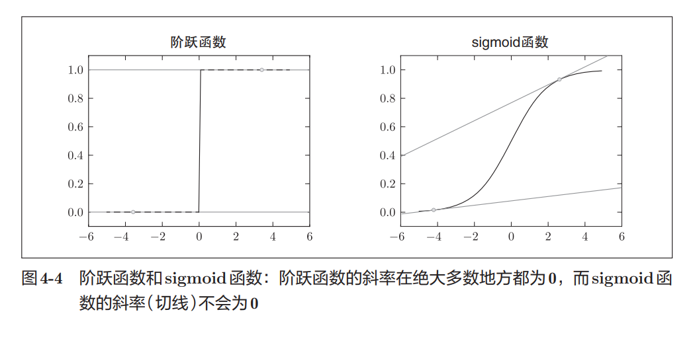

Sigmoid 具有两个重要特点：

- 输出连续变化
- 导数也连续变化

因此：

```python
参数变化一点
↓
输出变化一点
↓
损失变化一点
↓
梯度能够计算
```

神经网络才能顺利学习。

------

**本节重点**

- 神经网络依靠梯度（导数）更新参数。
- 识别精度是离散变化的，对微小参数变化几乎没有反应。
- 因此以识别精度作为优化目标时，大多数位置导数为 0。
- 损失函数是连续变化的，能够提供有效梯度。
- 神经网络训练时优化损失函数，而不是直接优化识别精度。
- 阶跃函数导数几乎处处为 0，因此不适合作为神经网络激活函数。
- Sigmoid 函数输出连续、导数连续，能够支持梯度学习。

## 4.3 数值微分

梯度法使用梯度的信息决定前进的方向。本节将介绍梯度是什么、有什么性质等内容。在这之前，我们先来介绍一下导数。

### 4.3.1 导数

在神经网络学习中，导数是一个非常重要的概念。

简单来说：

> 导数表示某个位置上，函数变化得有多快。

书中用马拉松举了一个例子。

假设运动员：

```python
10分钟跑了2千米
```

那么平均速度为：

```python
2 ÷ 10 = 0.2 千米/分钟
```

不过这里得到的是：

> 一段时间内的平均变化率

而导数关注的是：

> 某一个瞬间的变化率

就像汽车仪表盘显示的时速一样，它反映的是当前这一刻的速度，而不是整个行程的平均速度。

------

数学上，导数定义为：
$$
\frac{df(x)}{dx}=\lim_{h\to0}\frac{f(x+h)-f(x)}{h}
$$
其中：

- `f(x)` 表示函数
- `x` 表示当前位置
- `h` 表示一个极小的变化量

整个公式表达的含义是：

> 当 x 发生一个极小变化时，函数值会变化多少。

也可以理解为：

> 函数在该点切线的斜率。

------

#### 数值微分

理论上导数由极限定义：

```python
h → 0
```

但计算机无法真正表示“无限接近0”。

因此实际计算时，会使用一个很小的数来近似求导。

这种方法称为：

```python
数值微分（Numerical Differentiation）
```

最直接的实现方式如下：

```python
# 不好的实现示例
def numerical_diff(f, x):
    h = 1e-50
    return (f(x + h) - f(x)) / h
```

看起来完全符合导数定义，但实际上存在两个问题。

------

#### 问题一：h太小会产生舍入误差

代码中使用：

```python
h = 1e-50
```

希望尽可能接近0。

但计算机的浮点数精度有限。

例如：

```python
np.float32(1e-50)
```

结果：

```python
0.0
```

因为数字太小，已经超出了 float32 的表示能力。

这种由于精度不足导致的误差称为：

```python
舍入误差（Rounding Error）
```

因此实际计算中通常采用：

```python
h = 1e-4
```

即：

```python
0.0001
```

这个值已经足够小，同时又不会产生严重精度问题。

------

#### 问题二：前向差分本身存在误差

前面的公式实际上计算的是：

```python
f(x+h) - f(x)
```

对应图中的这条斜线：

```python
(x, f(x))
↓
(x+h, f(x+h))
```

求得的是两点连线的斜率。

而真正的导数应该是：

> x 点处切线的斜率

因此两者并不完全相同。

图中所示：

- 深色直线：真正切线
- 浅色直线：近似切线

两者存在一定偏差。

------

#### 中心差分

为了减小这种误差，通常采用：

```python
x+h
```

和

```python
x-h
```

两侧同时计算。

公式变为：
$$
\frac{f(x+h)-f(x-h)}{2h}
$$
这种方法称为：

```python
中心差分（Central Difference）
```

相比：

```python
f(x+h)-f(x)
```

的前向差分，

中心差分以 `x` 为中心进行计算，因此更加接近真实切线。

------

最终实现如下：

```python
def numerical_diff(f, x):
    h = 1e-4
    return (f(x+h) - f(x-h)) / (2*h)
```

这也是后续章节计算数值梯度时使用的方法。

------

#### 数值微分 vs 解析求导

求导大致有两种方式。

##### 1. 数值微分

利用差分近似：

```python
(f(x+h)-f(x-h))/(2*h)
```

特点：

- 简单直观
- 容易实现
- 存在近似误差
- 计算速度较慢

------

##### 2. 解析求导

直接利用数学公式推导。

例如：
$$
y=x^2
$$
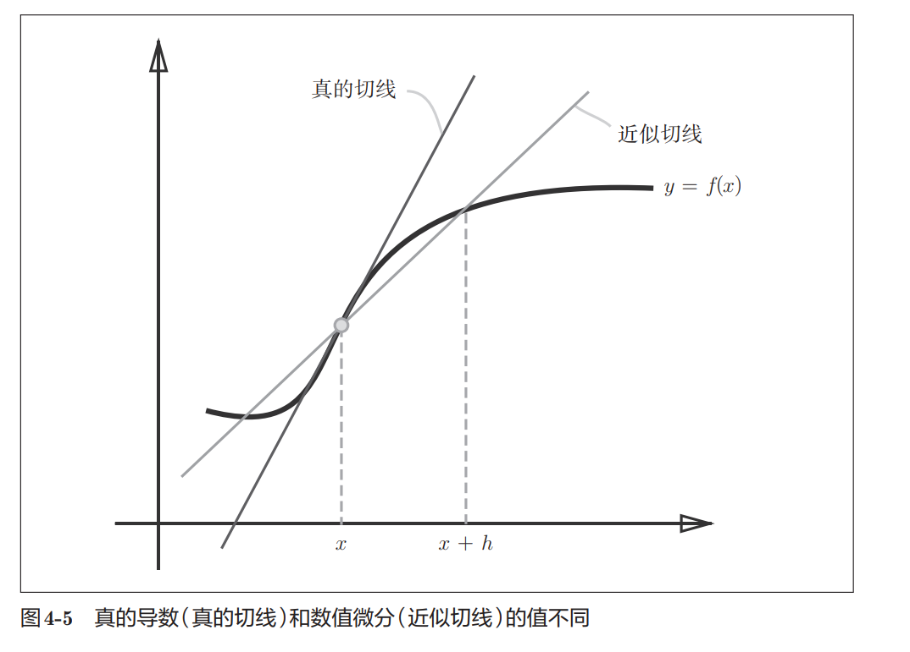

解析求导得到：
$$
\frac{dy}{dx}=2x
$$
当：

```python
x = 2
```

时：

```python
dy/dx = 4
```

这种方法得到的是理论上的真实导数。

特点：

- 没有数值误差
- 计算速度快
- 需要数学推导

------

**本节重点**

- 导数表示函数在某一点的瞬时变化率。

- 导数本质上对应函数切线的斜率。

- 计算机无法真正令 `h→0`，因此使用数值微分近似计算。

- `h` 太小会产生舍入误差。

- 前向差分误差较大，因此采用中心差分：

  ```python
  (f(x+h)-f(x-h))/(2h)
  ```

- 利用差分近似求导称为数值微分。

- 利用数学公式直接推导称为解析求导。

- 神经网络后续计算梯度时，会大量使用数值微分的思想。

### 4.3.2 数值微分的例子

前面介绍了数值微分的实现方法，下面通过一个具体例子来看看它的效果。

这里使用的函数是：
$$
y=0.01x^2+0.1x
$$
对应的 Python 实现：

```python
def function_1(x):
    return 0.01 * x**2 + 0.1 * x
```

------

#### 观察函数图像

利用 matplotlib 绘图后，可以得到如图4-6所示的曲线。

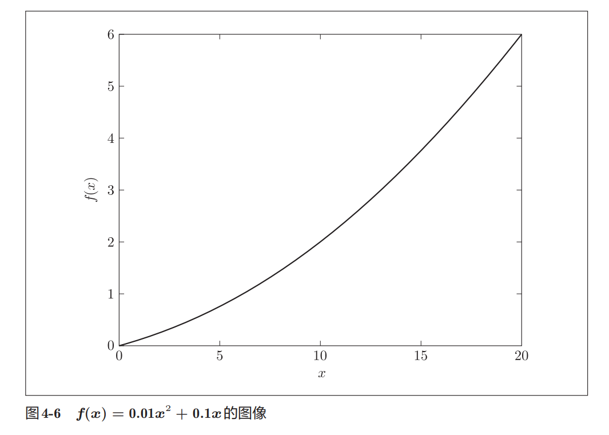

从图像可以发现：

- 函数整体单调递增
- 曲线越来越陡
- 说明随着 `x` 增大，函数变化速度也在增大

这也意味着：

> 函数的导数会随着 x 的增大而增大。

------

#### 使用数值微分计算导数

利用上一节实现的 `numerical_diff()`：

```python
numerical_diff(function_1, 5)
```

结果：

```python
0.1999999999990898
```

计算：

```python
numerical_diff(function_1, 10)
```

结果：

```python
0.2999999999986347
```

因此：

```python
x = 5  时，导数约为 0.2
x = 10 时，导数约为 0.3
```

这里的导数表示：

> x 每增加 1 个单位时，函数值大约增加多少。

例如：

```python
x = 5 时

导数 ≈ 0.2
```

表示附近区域内：

```python
x 增加 1

f(x) 大约增加 0.2
```

------

#### 与解析解比较

这个函数其实可以直接求导。

原函数：
$$
y=0.01x^2+0.1x
$$
解析求导得到：
$$
\frac{dy}{dx}=0.02x+0.1
$$
代入：

```python
x = 5
```

得到：

```python
0.02 × 5 + 0.1 = 0.2
```

代入：

```python
x = 10
```

得到：

```python
0.02 × 10 + 0.1 = 0.3
```

与数值微分结果：

```python
0.1999999999990898
0.2999999999986347
```

几乎完全一致。

误差仅来自浮点数计算。

------

#### 切线的含义

书中接着利用求出的导数绘制了切线。

例如：

```python
x = 5
```

处的切线斜率为：

```python
0.2
```

而：

```python
x = 10
```

处的切线斜率为：

```python
0.3
```

从图4-7可以明显看出：

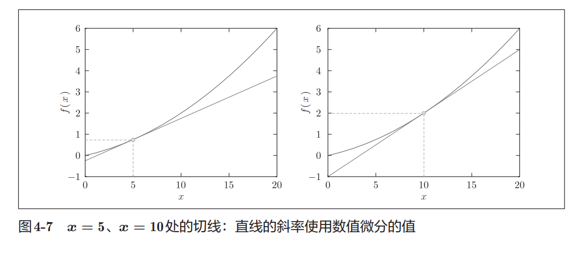

- `x=5` 处切线较平缓
- `x=10` 处切线更陡

这与我们刚刚计算出的导数大小完全一致：

```python
0.3 > 0.2
```

说明：

> 导数越大，函数增长得越快，切线也越陡。

------

#### 本节重点

- 数值微分可以近似计算函数在某一点的导数。

- 导数表示函数在该点的瞬时变化率。

- 对函数

  ```python
  y = 0.01x² + 0.1x
  ```

  而言：

  - `x=5` 时导数约为 `0.2`
  - `x=10` 时导数约为 `0.3`

- 解析求导结果为：
  $$
  \frac{dy}{dx}=0.02x+0.1
  $$
  
- 数值微分结果与解析解几乎一致。

- 导数本质上对应函数在该点切线的斜率。

- 导数越大，函数增长越快，切线越陡。

### 4.3.3 偏导数

前面讨论的导数只有一个变量，例如：
$$
y = x^2
$$
而在神经网络中，函数往往会包含多个参数。

因此，我们需要研究：

> 当函数有多个变量时，如何计算某个变量对结果的影响。

------

#### 多变量函数

这里使用的例子是：
$$
f(x_0, x_1)=x_0^2+x_1^2
$$
对应的 Python 实现：

```python
def function_2(x):
    return x[0]**2 + x[1]**2

# 等价写法
def function_2(x):
    return np.sum(x**2)
```

这里：

- `x[0]` 对应 $x_0$
- `x[1]` 对应 $x_1$

函数的作用很简单：

> 计算所有变量平方后的总和。

------

#### 函数图像

与前面的单变量函数不同：
$$
f(x_0,x_1)
$$
包含两个输入变量，因此图像不再是二维曲线，而是三维曲面。

从图4-8可以看到：

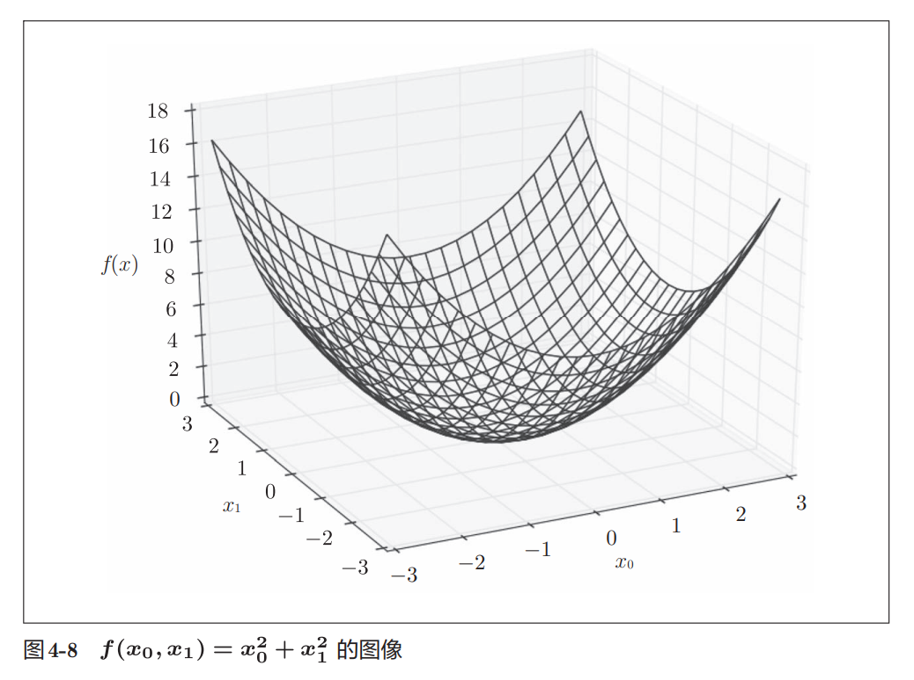

- 曲面像一个碗
- 最低点位于原点

即：
$$
(x_0,x_1)=(0,0)
$$
此时：
$$
f(x_0,x_1)=0
$$
取得最小值。

------

#### 什么是偏导数

对于多变量函数：
$$
f(x_0,x_1)
$$
我们可以分别研究：

- `x₀` 变化时函数如何变化
- `x₁` 变化时函数如何变化

这种只针对某一个变量求导的方法称为：

**偏导数（Partial Derivative）**

记作：
$$
\frac{\partial f}{\partial x_0}
$$
和
$$
\frac{\partial f}{\partial x_1}
$$
这里的符号：
$$
\partial
$$
表示偏导数。

------

#### 求关于 $x_0$ 的偏导数

题目：

> 当 `x₀=3`，`x₁=4` 时，求关于 `x₀` 的偏导数。

求偏导时：

```
固定 x₁
只让 x₀ 变化
```

因此把：
$$
x_1=4
$$
代入原函数：
$$
f(x_0)=x_0^2+4^2
$$
对应代码：

```python
def function_tmp1(x0):
    return x0*x0 + 4.0**2
```

然后直接调用数值微分：

```python
numerical_diff(function_tmp1, 3.0)
```

结果：

```python
6.00000000000378
```

约等于：
$$
6
$$

------

#### 求关于 $x_1$ 的偏导数

同理：

```
固定 x₀
只让 x₁ 变化
```

令：
$$
x_0=3
$$
得到：
$$
f(x_1)=3^2+x_1^2
$$
对应代码：

```python
def function_tmp2(x1):
    return 3.0**2 + x1*x1
```

计算：

```python
numerical_diff(function_tmp2, 4.0)
```

结果：

```python
7.999999999999119
```

约等于：
$$
8
$$

------

#### 为什么结果是 6 和 8？

原函数：
$$
f(x_0,x_1)=x_0^2+x_1^2
$$
解析求偏导：

对 `x₀` 求导：
$$
\frac{\partial f}{\partial x_0}=2x_0
$$
代入：
$$
x_0=3
$$
得到：
$$
2\times3=6
$$

------

对 `x₁` 求导：
$$
\frac{\partial f}{\partial x_1}=2x_1
$$
代入：
$$
x_1=4
$$
得到：
$$
2\times4=8
$$
与数值微分的结果完全一致。

------

#### 偏导数的本质

偏导数和普通导数本质上是一样的：

> 都是在求某一点的斜率。

区别在于：

普通导数：

```python
只有一个变量
```

偏导数：

```python
有多个变量

只研究其中一个变量

其余变量保持不变
```

因此可以简单记忆：

> 偏导数 = 固定其它变量后，对目标变量求导。

------

#### 本节重点

- 多变量函数包含多个输入变量。

- 对多变量函数求导时得到的是偏导数。

- 偏导数表示：

  > 固定其它变量时，目标变量变化对函数的影响。

- 对于函数：
  $$
  f(x_0,x_1)=x_0^2+x_1^2
  $$
  有：
  $$
  \frac{\partial f}{\partial x_0}=2x_0
  $$

  $$
  \frac{\partial f}{\partial x_1}=2x_1
  $$

- 当 `(x₀,x₁)=(3,4)` 时：
  $$
  \frac{\partial f}{\partial x_0}=6
  $$

  $$
  \frac{\partial f}{\partial x_1}=8
  $$

- 计算偏导数时，需要固定其它变量，仅让目标变量发生变化。

## 4.4 梯度

前面学习偏导数时，我们分别计算了：
$$
\frac{\partial f}{\partial x_0}
$$
和
$$
\frac{\partial f}{\partial x_1}
$$
但对于多变量函数来说，仅仅知道单个变量的变化情况还不够。

我们希望能够同时描述：

> 所有变量变化时，函数会朝哪个方向变化。

因此引入了**梯度（Gradient）**的概念。

------

#### 什么是梯度

对于多变量函数：
$$
f(x_0,x_1)
$$
把所有偏导数组合在一起：
$$
\left(
\frac{\partial f}{\partial x_0},
\frac{\partial f}{\partial x_1}
\right)
$$
得到的向量称为梯度。

例如：
$$
f(x_0,x_1)=x_0^2+x_1^2
$$
在点：
$$
(3,4)
$$
处：
$$
\frac{\partial f}{\partial x_0}=6
$$
因此梯度为：
$$
(6,8)
$$
梯度可以理解为：

> 函数在各个变量方向上的变化率组成的向量。

------

#### numerical_gradient 的实现思路

```python
def _numerical_gradient(f, x):
    h = 1e-4 # 0.0001
    grad = np.zeros_like(x)
    
    for idx in range(x.size):
        tmp_val = x[idx]
        x[idx] = float(tmp_val) + h
        fxh1 = f(x) # f(x+h)
        
        x[idx] = tmp_val - h 
        fxh2 = f(x) # f(x-h)
        grad[idx] = (fxh1 - fxh2) / (2*h)
        
        x[idx] = tmp_val # 还原值
        
    return grad
```


书中的 `numerical_gradient()` 本质上是在做：

1. 固定其它变量
2. 对当前变量做中心差分
3. 计算偏导数
4. 把所有偏导数存入数组
5. 返回最终梯度向量

例如：

```python
numerical_gradient(function_2, np.array([3.0, 4.0]))
```

结果：

```python
array([6., 8.])
```

表示：
$$
\nabla f(3,4)
=
(6,8)
$$
同样：

```python
numerical_gradient(function_2, np.array([0.0, 2.0]))
```

得到：

```python
array([0., 4.])
```

说明：
$$
\nabla f(0,2)
=
(0,4)
$$

------

#### 梯度图的含义

对于函数：
$$
f(x_0,x_1)=x_0^2+x_1^2
$$
书中绘制了对应的梯度图。

图中的每个箭头都是一个梯度向量。

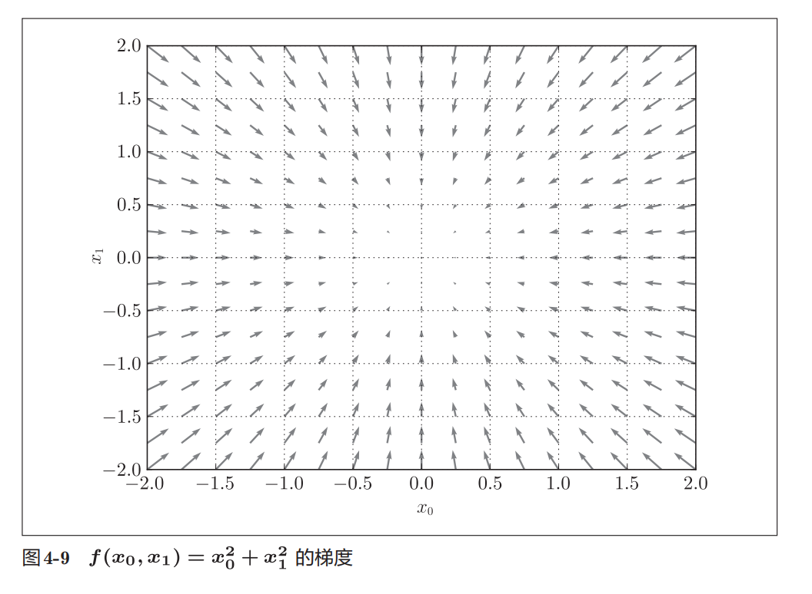

观察图像可以发现：

- 箭头都指向原点附近
- 离原点越远，箭头越长
- 越接近原点，箭头越短

这是因为：
$$
(0,0)
$$
是该函数的最小值点。

------

#### 梯度表示什么方向

梯度最重要的性质是：

> 梯度指向函数值增加最快的方向。

例如：

在点：
$$
(3,4)
$$
处，

梯度为：
$$
(6,8)
$$
说明如果沿着：
$$
(6,8)
$$
这个方向移动，

函数值会增长得最快。

------

#### 为什么图中箭头指向最低点

书中特别说明：

图4-9画的并不是梯度本身，而是：
$$
-\nabla f
$$
即负梯度。

因此图中的箭头全部朝向函数最低处。

对于：
$$
f(x_0,x_1)=x_0^2+x_1^2
$$
最低点位于：
$$
(0,0)
$$
所以所有箭头都指向原点。

------

#### 梯度与神经网络学习

神经网络训练时，我们希望：

> 损失函数不断减小。

而梯度告诉我们：

> 哪个方向增长最快。

因此只需要朝着相反方向移动即可：
$$
-\nabla f
$$
这就是：

> 函数值下降最快的方向。

后面要学习的梯度下降法（Gradient Descent），正是利用这一性质不断更新参数，从而找到损失函数的最小值。

------

#### 本节重点

- 梯度是所有偏导数组成的向量。
- 梯度描述了函数在各个变量方向上的变化率。
- `numerical_gradient()` 通过分别计算偏导数来求梯度。
- 梯度指向函数值增加最快的方向。
- 负梯度指向函数值减小最快的方向。
- 图4-9绘制的是负梯度，因此箭头都指向最低点。
- 神经网络后续的参数优化，本质上就是沿着负梯度方向不断更新参数。

### 4.4.1 梯度法

机器学习和神经网络训练的目标，本质上都是寻找一组最优参数，使损失函数尽可能小。

但现实中的损失函数通常十分复杂：

- 参数很多
- 搜索空间很大
- 无法直接求出最小值

因此需要一种能够逐步逼近最优解的方法，这就是**梯度法（Gradient Method）**。

------

#### 梯度法的基本思想

前面学习过：

> 梯度指向函数值增加最快的方向。

那么：
$$
-\nabla f
$$
自然就是函数值下降最快的方向。

因此，如果想让损失函数不断减小，只需要不断沿着负梯度方向移动即可。

梯度法的过程可以概括为：

```
当前位置
↓
计算梯度
↓
沿负梯度方向移动一步
↓
到达新位置
↓
重新计算梯度
↓
继续移动
```

不断重复这个过程，就有机会逐渐靠近函数的最小值。

------

#### 梯度不一定指向最小值

这里有一个容易误解的地方。

很多人会认为：

> 梯度是不是直接指向最小值？

答案是否定的。

梯度只能保证：

> 在当前位置附近，沿这个方向函数下降最快。

但无法保证：

> 这个方向最终一定能到达全局最小值。

对于复杂函数来说，还可能遇到：

- 局部最小值（Local Minimum）
- 鞍点（Saddle Point）
- 学习高原（Plateau）

例如：

- 局部最小值：某个小区域内最小，但不是全局最小
- 鞍点：某个方向是极大值，另一个方向是极小值
- 学习高原：梯度非常小，参数更新几乎停止

因此梯度法并不是万能的，但它依然是深度学习中最常用的优化方法。

------

#### 梯度下降更新公式

梯度法可以写成下面的更新公式：
$$
x_0=x_0-\eta \frac{\partial f}{\partial x_0}
$$
其中：

- $\eta$：学习率（Learning Rate）
- $\frac{\partial f}{\partial x_i}$：对应变量的偏导数

可以看出：

```python
新参数 = 旧参数 - 学习率 × 梯度
```

因为减去了梯度，所以参数会朝着函数值减小的方向移动。

------

#### 学习率（Learning Rate）

公式中的：
$$
\eta
$$
称为学习率。

学习率决定：

> 每次沿梯度方向前进多远。

例如：

```python
学习率大
↓
一步跨得远

学习率小
↓
一步跨得近
```

学习率是梯度法中最重要的参数之一。

------

#### 梯度下降法实现

书中的实现如下：

```python
def gradient_descent(f, init_x, lr=0.01, step_num=100):
    x = init_x

    for i in range(step_num):
        grad = numerical_gradient(f, x)
        x -= lr * grad

    return x
```

参数说明：

- `f`：目标函数
- `init_x`：初始位置
- `lr`：学习率（learning rate）
- `step_num`：迭代次数

核心代码只有一句：

```python
x -= lr * grad
```

对应的就是梯度下降更新公式。

------

#### 求函数最小值的例子

目标函数：
$$
f(x_0,x_1)=x_0^2+x_1^2
$$
初始点：
$$
(-3,4)
$$
执行：

```python
gradient_descent(
    function_2,
    init_x=np.array([-3.0, 4.0]),
    lr=0.1,
    step_num=100
)
```

结果：

```python
array([
 -6.11110793e-10,
  8.14814391e-10
])
```

即：
$$
(-0.0000000006,\;0.0000000008)
$$
已经非常接近：
$$
(0,0)
$$
而对于这个函数来说：
$$
(0,0)
$$
正是最小值点。

因此梯度下降法成功找到了最优解。

------

#### 梯度下降过程

图4-10展示了参数更新轨迹。

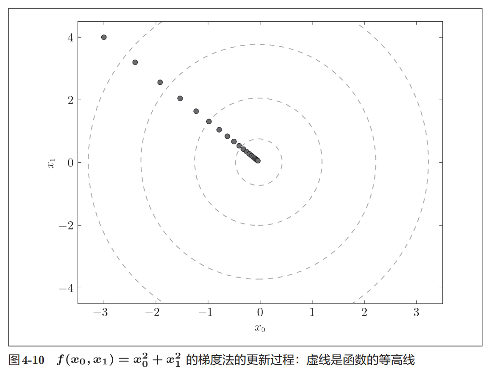

虚线表示函数的等高线。

可以把它想象成：

```
山谷中的地形图
```

而梯度下降法就是：

```
从山坡某处出发
↓
不断朝下坡方向走
↓
最终靠近谷底
```

在图中可以明显看到：

- 起点是 `(-3,4)`
- 每次更新都更接近原点
- 最终逐渐收敛到最小值附近

------

#### 学习率过大的问题

如果学习率设置得太大：

```python
lr = 10.0
```

结果：

```python
array([
 -2.58983747e+13,
 -1.29524862e+12
])
```

数值直接爆炸。

原因是：

```python
一步跨太远
↓
越过最低点
↓
继续越过
↓
不断震荡甚至发散
```

最终无法收敛。

------

#### 学习率过小的问题

如果学习率设置得太小：

```python
lr = 1e-10
```

结果：

```python
array([
 -2.99999994,
  3.99999992
])
```

几乎没发生变化。

原因是：

```python
每次只移动一点点
↓
100步根本走不远
↓
训练效率极低
```

因此学习率过小也不好。

------

#### 超参数

学习率属于：

**超参数（Hyperparameter）**

超参数与权重参数不同：

| 类型       | 获取方式           |
| ---------- | ------------------ |
| 权重、偏置 | 训练过程中自动学习 |
| 学习率     | 人工设定           |

因此实际训练时通常需要：

- 尝试多个学习率
- 比较训练效果
- 选择最合适的参数

------

#### 本节重点

- 梯度法利用梯度信息寻找函数最小值。
- 梯度指向函数值增长最快的方向。
- 负梯度指向函数值下降最快的方向。
- 梯度下降法不断沿负梯度方向更新参数。
- 更新公式：

$$
x=x-\eta\nabla f
$$

- 学习率决定每次更新的步长。
- 学习率过大容易发散。
- 学习率过小收敛速度很慢。
- 学习率属于超参数，需要人工设定。
- 梯度下降法是神经网络训练中最核心的优化思想之一。

### 4.4.2 神经网络的梯度

前面学习的梯度都是针对普通数学函数，例如：
$$
f(x_0,x_1)=x_0^2+x_1^2
$$
而在神经网络中，我们真正关心的是：

> 权重参数发生变化时，损失函数会如何变化。

因此，神经网络中的梯度实际上是：

> 损失函数对权重参数的偏导数。

------

#### 权重矩阵的梯度

假设神经网络有一个权重矩阵：
$$
W=
\begin{pmatrix}
w_{11} & w_{12} & w_{13}\\
w_{21} & w_{22} & w_{23}
\end{pmatrix}
$$
损失函数记为：
$$
L
$$
那么梯度定义为：
$$
\frac{\partial L}{\partial W}
=
\begin{pmatrix}
\frac{\partial L}{\partial w_{11}} &
\frac{\partial L}{\partial w_{12}} &
\frac{\partial L}{\partial w_{13}}
\\
\frac{\partial L}{\partial w_{21}} &
\frac{\partial L}{\partial w_{22}} &
\frac{\partial L}{\partial w_{23}}
\end{pmatrix}
$$
可以发现：

> 梯度矩阵的形状与权重矩阵完全相同。

如果：

```python
W.shape = (2,3)
```

那么：

```python
dW.shape = (2,3)
```

------

#### simpleNet 类

为了演示神经网络梯度的计算，书中实现了一个极简神经网络：

```python
class simpleNet:
    def __init__(self):
        self.W = np.random.randn(2, 3)

    def predict(self, x):
        return np.dot(x, self.W)

    def loss(self, x, t):
        z = self.predict(x)
        y = softmax(z)
        loss = cross_entropy_error(y, t)

        return loss
```

这个网络非常简单：

```python
输入层(2)
    ↓
权重W(2×3)
    ↓
输出层(3)
    ↓
Softmax
    ↓
交叉熵误差
```

主要包含两个方法：

- `predict(x)`：计算预测结果
- `loss(x, t)`：计算损失函数

------

#### 前向传播过程

假设随机初始化得到：

```python
net.W
[
 [0.47, 0.99, 0.84],
 [0.85, 0.03, 0.69]
]
```

输入：

```python
x = np.array([0.6, 0.9])
```

预测：

```python
p = net.predict(x)
```

本质上是在做：
$$
xW
$$
得到：

```python
[1.05, 0.63, 1.13]
```

表示：

```python
类别0得分：1.05
类别1得分：0.63
类别2得分：1.13
```

------

然后：

```python
np.argmax(p)
```

结果：

```python
2
```

说明模型认为：

> 第2类概率最大。

------

正确答案：

```python
t = [0,0,1]
```

表示：

```python
正确类别 = 2
```

接着计算损失：

```python
net.loss(x, t)
```

得到：

```python
0.928...
```

这就是当前参数下的损失函数值。

------

#### 求权重的梯度

目标：

> 求损失函数关于权重矩阵 W 的梯度。

即：
$$
\frac{\partial L}{\partial W}
$$

------

定义函数：

```python
def f(W):
    return net.loss(x, t)
```

这里要特别注意：

虽然写了：

```python
f(W)
```

但实际上：

```python
W
```

会被 `numerical_gradient()` 自动修改。

因此：

```python
net.loss(x,t)
```

内部计算时使用的其实是变化后的：

```python
net.W
```

------

然后：

```python
dW = numerical_gradient(f, net.W)
```

得到：

```python
[
 [ 0.219  0.144 -0.363]
 [ 0.329  0.215 -0.544]
]
```

即：
$$
dW=
\begin{pmatrix}
0.219 & 0.144 & -0.363\\
0.329 & 0.215 & -0.544
\end{pmatrix}
$$

------

#### 如何理解梯度矩阵

例如：
$$
\frac{\partial L}{\partial w_{11}}
\approx 0.219
$$
表示：

> 如果把 $w_{11}$ 增加一点，损失函数也会增加。

因此：

```python
应该减小 w11
```

------

再看：
$$
\frac{\partial L}{\partial w_{23}}
\approx -0.544
$$
表示：

> 如果把 $w_{23}$ 增加一点，损失函数反而会减小。

因此：

```python
应该增大 w23
```

------

可以发现：

- 正梯度 → 参数往负方向更新
- 负梯度 → 参数往正方向更新

这正是梯度下降法：
$$
W=W-\eta \frac{\partial L}{\partial W}
$$
的思想。

------

#### lambda 写法

书中最后给出了更简洁的写法：

```python
f = lambda w: net.loss(x, t)
dW = numerical_gradient(f, net.W)
```

与前面的：

```python
def f(W):
    return net.loss(x, t)
```

效果完全相同。

只是代码更简洁。

------

#### 本节重点

- 神经网络学习的目标是优化损失函数。
- 神经网络中的梯度是损失函数对权重参数的偏导数。
- 梯度矩阵与权重矩阵形状相同。
- `simpleNet` 实现了一个最简单的两层网络结构。
- `predict()` 负责前向传播。
- `loss()` 负责计算交叉熵误差。
- `numerical_gradient()` 可以计算权重矩阵的梯度。
- 梯度的正负表示参数应该增大还是减小。
- 神经网络训练的核心就是：

$$
W=W-\eta\frac{\partial L}{\partial W}
$$

不断利用梯度更新权重，使损失函数逐渐减小。

## 4.5 学习算法的实现

前面已经介绍了神经网络学习所需的核心概念：

- 损失函数（Loss Function）
- Mini-Batch
- 梯度（Gradient）
- 梯度下降法（Gradient Descent）

这些内容组合起来，就构成了神经网络完整的学习流程。

神经网络学习的本质可以概括为：

> 通过不断调整权重和偏置，使损失函数越来越小，从而让模型的预测结果越来越接近真实答案。

------

#### 学习前提

神经网络中存在大量参数：

- 权重（Weight）
- 偏置（Bias）

学习（Training）的过程，就是不断调整这些参数，使模型能够更好地拟合训练数据。

------

#### 步骤1：随机抽取 Mini-Batch

首先从训练集中随机选取一小部分样本：

```
训练集
↓
随机抽样
↓
Mini-Batch
```

例如：

```
60000条训练数据
↓
随机抽取100条
```

这一小批数据就是当前轮训练所使用的数据。

训练目标是：

> 让这批数据对应的损失函数尽可能小。

------

#### 步骤2：计算梯度

利用当前 Mini-Batch 计算损失函数。

然后求出损失函数对各个参数的梯度：
$$
\frac{\partial L}{\partial W}
$$
梯度表示：

> 当前参数应该朝哪个方向调整，才能最快降低损失函数。

------

#### 步骤3：更新参数

根据梯度下降法更新参数：
$$
W=W-\eta\frac{\partial L}{\partial W}
$$
其中：

- $W$：权重参数
- $\eta$：学习率
- $\frac{\partial L}{\partial W}$：梯度

更新后，模型参数会朝着损失更小的方向移动一点。

------

#### 步骤4：重复训练

重复执行：

```
抽取 Mini-Batch
↓
计算梯度
↓
更新参数
↓
再次抽取 Mini-Batch
```

经过大量迭代后：

- 损失函数逐渐减小
- 模型预测越来越准确
- 参数逐渐收敛到较优位置

------

#### 随机梯度下降法（SGD）

由于每次使用的都是：

```
随机抽取的 Mini-Batch
```

因此这种训练方式称为：

**随机梯度下降法（Stochastic Gradient Descent，SGD）**

名称来源：

- Stochastic：随机的
- Gradient：梯度
- Descent：下降

缩写为：

```
SGD
```

很多深度学习框架中都会直接提供：

```
SGD(...)
```

优化器，其原理正是这里介绍的随机梯度下降法。

------

#### 本节重点

- 神经网络学习的目标是找到更优的权重和偏置。

- 学习过程由 Mini-Batch、梯度计算和参数更新组成。

- 每轮训练包含四个步骤：

  ```
  Mini-Batch
  ↓
  计算梯度
  ↓
  更新参数
  ↓
  重复
  ```

- 梯度用于指示损失函数下降最快的方向。

- 参数通过梯度下降法不断更新。

- 使用随机抽取的 Mini-Batch 进行梯度下降，称为随机梯度下降法（SGD）。

- SGD 是深度学习中最基础、最常见的优化算法。

### 4.5.1 2层神经网络的类

前面已经介绍了神经网络学习所需的全部基础知识：

- 损失函数
- Mini-Batch
- 梯度
- 梯度下降法

接下来，书中将这些内容组合起来，实现一个真正能够学习的两层神经网络——`TwoLayerNet`。

这里的网络结构如下：

```python
输入层(784)
    ↓
隐藏层(100)
    ↓
输出层(10)
```

其中：

- 输入层：MNIST图片（28×28=784）
- 隐藏层：100个神经元（可自行调整）
- 输出层：10个神经元（对应数字0~9）

------

#### params：保存网络参数

`params` 是一个字典，用来保存神经网络中的所有参数。

包括：

```python
params['W1']
params['b1']
params['W2']
params['b2']
```

分别表示：

| 参数 | 含义                |
| ---- | ------------------- |
| W1   | 输入层 → 隐藏层权重 |
| b1   | 隐藏层偏置          |
| W2   | 隐藏层 → 输出层权重 |
| b2   | 输出层偏置          |

对于：

```python
net = TwoLayerNet(
    input_size=784,
    hidden_size=100,
    output_size=10
)
```

参数形状为：

```python
W1.shape = (784, 100)
b1.shape = (100,)

W2.shape = (100, 10)
b2.shape = (10,)
```

可以发现：

```python
784 → 100 → 10
```

正好对应网络结构。

------

#### 参数初始化

初始化代码：

```python
self.params['W1'] = \
    0.01 * np.random.randn(input_size, hidden_size)

self.params['W2'] = \
    0.01 * np.random.randn(hidden_size, output_size)
```

这里：

```python
np.random.randn(...)
```

表示从高斯分布（正态分布）中随机生成数据。

因此：

```python
权重 = 随机小数
```

而偏置：

```python
np.zeros(...)
```

全部初始化为：

```python
0
```

------

#### predict()：前向传播

```python
def predict(self, x):
```

负责执行神经网络的推理过程。

具体流程：

```python
a1 = np.dot(x, W1) + b1
z1 = sigmoid(a1)

a2 = np.dot(z1, W2) + b2
y = softmax(a2)
```

对应结构：

```python
输入x
    ↓
W1+b1
    ↓
Sigmoid
    ↓
W2+b2
    ↓
Softmax
    ↓
输出y
```

最终返回：

```python
y
```

即：

```python
各类别的预测概率
```

------

#### loss()：计算损失函数

```python
def loss(self, x, t):
```

流程：

```python
预测
↓
softmax
↓
交叉熵误差
```

代码：

```python
y = self.predict(x)

return cross_entropy_error(y, t)
```

返回值：

```python
当前网络的损失函数值
```

------

#### accuracy()：计算识别精度

```python
def accuracy(self, x, t):
```

用于评估模型效果。

首先找到预测概率最大的类别：

```python
y = np.argmax(y, axis=1)
```

然后把 One-Hot 标签转回数字：

```python
t = np.argmax(t, axis=1)
```

统计：

```python
预测正确数量
───────────
样本总数
```

得到：

```python
accuracy
```

即识别精度。

------

#### grads：保存梯度

与 `params` 对应，

梯度保存在：

```python
grads
```

字典中。

包括：

```python
grads['W1']
grads['b1']
grads['W2']
grads['b2']
```

分别对应：

```python
W1的梯度
b1的梯度
W2的梯度
b2的梯度
```

并且：

```python
梯度形状
=
参数形状
```

例如：

```python
grads['W1'].shape
```

结果：

```python
(784,100)
```

与：

```python
params['W1'].shape
```

完全一致。

------

#### numerical_gradient()：计算梯度

```python
def numerical_gradient(self, x, t):
```

负责计算：
$$
\frac{\partial L}{\partial W}
$$
即损失函数对各参数的梯度。

核心代码：

```python
loss_W = lambda W: self.loss(x, t)
```

然后分别计算：

```python
grads['W1']
grads['b1']
grads['W2']
grads['b2']
```

的梯度。

最终返回：

```python
grads
```

------

#### 为什么还要写 gradient()

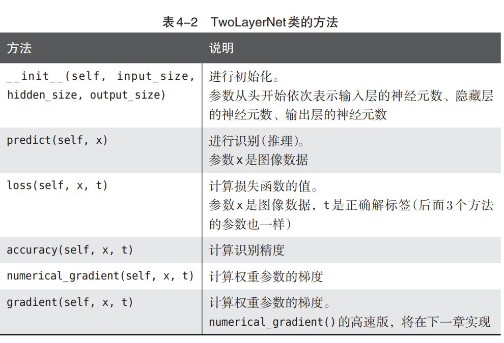

书中表4-2还有一个：

```python
gradient(self, x, t)
```

但本章并没有实现。

原因是：

```python
numerical_gradient()
```

采用数值微分：

```python
精确
但是非常慢
```

而下一章会学习：

**误差反向传播（Backpropagation）**

利用它可以实现：

```python
gradient()
```

特点：

```python
结果几乎一样
速度快很多
```

因此：

```python
numerical_gradient()
```

主要用于：

- 理解梯度
- 验证反向传播结果

真正训练神经网络时，一般使用后面的：

```python
gradient()
```

------

#### 本节重点

- `TwoLayerNet` 是一个两层神经网络类。

- 网络结构为：

  ```python
  输入层
      ↓
  隐藏层
      ↓
  输出层
  ```

- `params` 保存所有权重和偏置。

- `predict()` 实现前向传播。

- `loss()` 计算交叉熵误差。

- `accuracy()` 计算识别精度。

- `grads` 保存各参数的梯度。

- `numerical_gradient()` 使用数值微分计算梯度。

- 下一章将使用误差反向传播实现更高效的 `gradient()` 方法。

### 4.5.2 mini-batch的实现

这里开始真正训练 `TwoLayerNet`。

训练流程就是前面总结过的 SGD：

```python
随机抽取 Mini-Batch
↓
计算梯度
↓
更新参数
↓
记录损失
```

代码中的核心超参数是：

```python
iters_num = 10000
batch_size = 100
learning_rate = 0.1
```

含义分别是：

- `iters_num`：参数更新次数
- `batch_size`：每次随机抽取100条数据
- `learning_rate`：学习率

每次循环中，先随机抽取 Mini-Batch：

```python
batch_mask = np.random.choice(train_size, batch_size)
x_batch = x_train[batch_mask]
t_batch = t_train[batch_mask]
```

然后计算梯度：

```python
grad = network.numerical_gradient(x_batch, t_batch)
```

再根据梯度下降法更新参数：

```python
for key in ('W1', 'b1', 'W2', 'b2'):
    network.params[key] -= learning_rate * grad[key]
```

这一步对应公式：
$$
W = W - \eta \frac{\partial L}{\partial W}
$$
最后记录当前 Mini-Batch 的损失：

```python
loss = network.loss(x_batch, t_batch)
train_loss_list.append(loss)
```

从图4-11可以看出，随着训练进行，损失函数整体在下降。

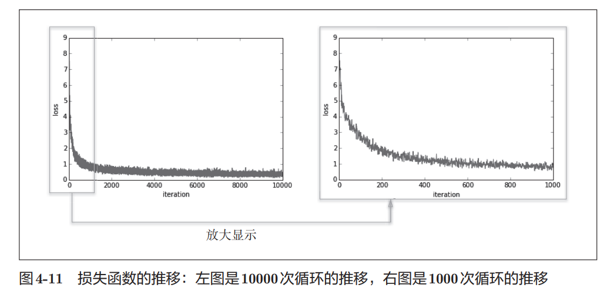

这说明：

> 网络参数正在逐渐调整到更适合训练数据的位置。

换句话说，神经网络确实在学习。

### 4.5.3 基于测试数据的评价

只看训练损失下降还不够。

因为训练损失下降只能说明：

> 模型越来越适应训练数据。

但我们真正关心的是：

> 模型能不能正确识别没见过的数据。

这就是泛化能力。

如果模型只在训练数据上表现很好，但在测试数据上表现很差，就说明发生了**过拟合**。

------

#### epoch 的含义

这里引入了一个概念：

```python
epoch
```

一个 epoch 可以理解为：

> 所有训练数据大致被使用过一遍。

例如：

```python
训练数据：10000条
batch_size：100
```

那么大约需要：

```python
100次更新 = 1个epoch
```

在代码中：

```python
iter_per_epoch = max(train_size / batch_size, 1)
```

表示每经过多少次迭代，就算一个 epoch。

------

#### 为什么按 epoch 记录准确率

每次更新都计算训练集和测试集准确率，开销太大。

所以代码选择：

```python
if i % iter_per_epoch == 0:
```

也就是每经过一个 epoch，再计算一次：

```python
train_acc = network.accuracy(x_train, t_train)
test_acc = network.accuracy(x_test, t_test)
```

然后分别记录：

```python
train_acc_list.append(train_acc)
test_acc_list.append(test_acc)
```

这样可以观察模型在训练集和测试集上的整体表现。

------

#### 如何判断是否过拟合

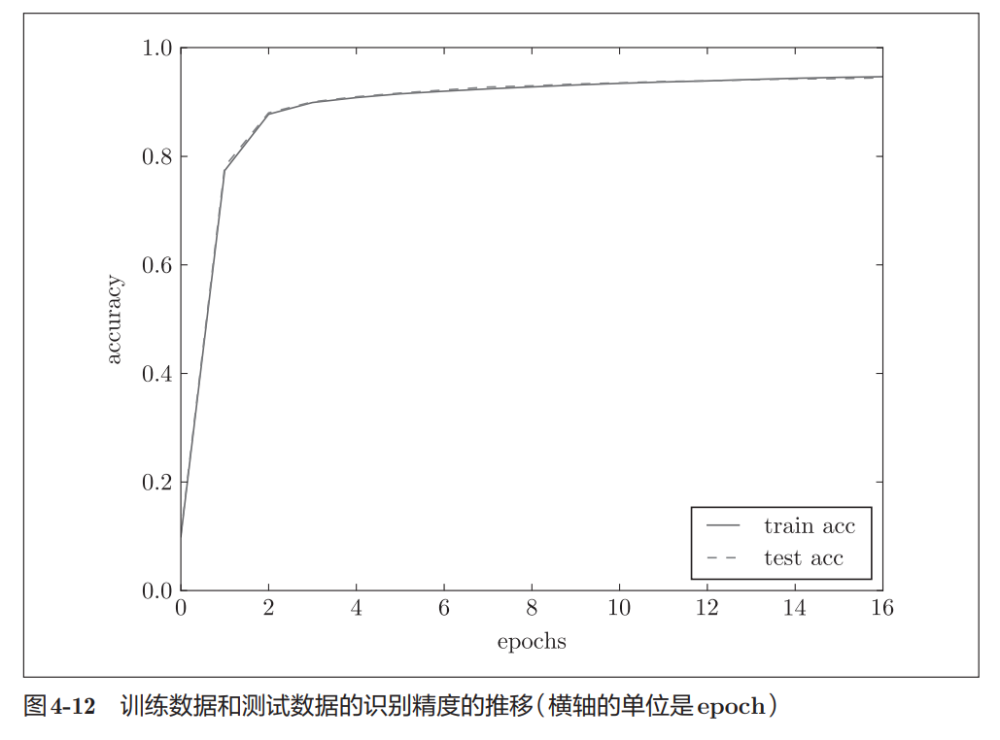

图4-12中：

- 实线：训练集准确率
- 虚线：测试集准确率

可以看到两条线都在上升，而且基本重合。

这说明：

> 模型不仅在训练数据上表现变好，在测试数据上也同步变好。

因此这次训练没有明显过拟合。

如果发生过拟合，通常会看到：

```python
训练集准确率继续上升
测试集准确率停滞甚至下降
```

也就是两条曲线逐渐拉开。

------

#### 本节重点

- Mini-Batch 学习每次只随机抽取一小批数据训练。
- SGD 的核心流程是：抽样、算梯度、更新参数。
- 损失函数下降，说明模型正在学习。
- 只看训练损失不够，还要观察测试集表现。
- `epoch` 表示训练数据大致被使用过一遍。
- 训练集准确率和测试集准确率都提高，说明模型具备一定泛化能力。
- 如果训练集表现好、测试集表现差，就说明可能发生过拟合。

## 4.6 小结

本章正式介绍了神经网络的学习过程。

神经网络学习的目标并不是直接提高识别率，而是通过不断调整权重和偏置，使损失函数的值持续减小。为了实现这一目标，本章引入了损失函数、梯度、梯度下降法等重要概念，并最终实现了一个能够在 MNIST 数据集上进行学习的两层神经网络。

从整体流程来看，神经网络学习的核心步骤为：

```python
训练数据
    ↓
计算损失函数
    ↓
计算梯度
    ↓
更新参数
    ↓
重复迭代
```

随着不断迭代，损失函数逐渐减小，模型的识别能力也不断提高。

------

### 本章重点

#### 数据集划分

- 机器学习中的数据通常分为：
  - 训练数据（Training Data）
  - 测试数据（Test Data）
- 使用训练数据学习参数。
- 使用测试数据评估模型泛化能力。

------

#### 泛化能力

- 泛化能力指模型处理未知数据的能力。
- 机器学习的最终目标不是记住训练数据，而是正确处理从未见过的新数据。
- 过拟合会导致训练集表现很好，但测试集表现较差。

------

#### 损失函数

- 损失函数用于衡量模型预测结果与真实结果之间的差距。
- 神经网络学习的目标是：

$$
Loss \rightarrow Min
$$

- 常见损失函数：
  - 均方误差（MSE）
  - 交叉熵误差（Cross Entropy Error）

------

#### Mini-Batch 学习

- 每次不使用全部训练数据。
- 从训练集中随机抽取一小部分数据进行训练。

```python
训练集
    ↓
随机抽样
    ↓
Mini-Batch
```

- 这样能够大幅降低计算量，提高训练效率。

------

#### 数值微分

- 导数表示函数在某一点的变化率。
- 数值微分使用有限差分近似求导：

$$
\frac{f(x+h)-f(x-h)}{2h}
$$

- 实现简单，但计算效率较低。

------

#### 梯度

梯度是所有偏导数构成的向量：
$$
\nabla f
=
\left(
\frac{\partial f}{\partial x_0},
\frac{\partial f}{\partial x_1},
...
\right)
$$
梯度表示：

> 函数值增长最快的方向。

负梯度表示：

> 函数值下降最快的方向。

------

#### 梯度下降法

参数更新公式：
$$
W
=
W
-
\eta
\frac{\partial L}{\partial W}
$$
其中：

- $W$：参数
- $\eta$：学习率
- $\frac{\partial L}{\partial W}$：梯度

梯度下降法是神经网络最基础的优化方法。

------

#### 神经网络中的梯度

神经网络学习时，需要计算：
$$
\frac{\partial L}{\partial W}
$$
即：

> 损失函数关于权重参数的梯度。

梯度告诉我们：

- 哪个参数应该增大
- 哪个参数应该减小
- 应该调整多少

------

#### TwoLayerNet

本章实现了第一个完整的可学习神经网络：

```python
输入层
    ↓
隐藏层
    ↓
输出层
```

主要实现了：

- `predict()`：前向传播
- `loss()`：计算损失
- `accuracy()`：计算精度
- `numerical_gradient()`：计算梯度

------

#### SGD（随机梯度下降）

完整学习流程：

```python
随机抽取 Mini-Batch
        ↓
计算损失函数
        ↓
计算梯度
        ↓
更新参数
        ↓
重复执行
```

这就是随机梯度下降法（SGD）。

------

#### 学习效果评估

评价神经网络时需要同时观察：

- 训练集准确率（Train Accuracy）
- 测试集准确率（Test Accuracy）

如果：

```python
Train Acc ↑
Test Acc ↑
```

说明模型学习正常。

如果：

```python
Train Acc ↑
Test Acc ↓
```

则可能发生过拟合。

------

### 一句话总结本章

> 本章建立了神经网络学习的完整框架：利用损失函数衡量误差，通过数值微分求梯度，再使用梯度下降法不断更新参数，最终实现了基于 Mini-Batch SGD 的两层神经网络训练流程。

